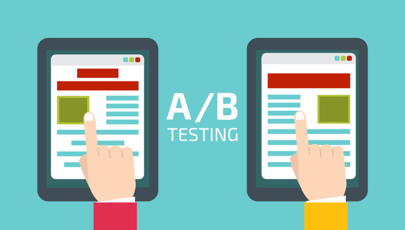
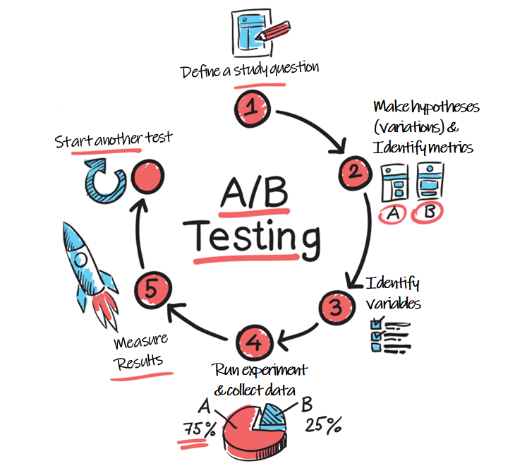

<p class='twelve columns' style="text-align: center;">

</p>

## Short Notes on A/B Testing

### Motivation

+ Understand what drives your business and provide insights for business decisions  
+ Understand causal relationship

### Prerequisites

+ The control and testing groups can be clearly defined
+ Metrics of interest can be quantified
+ Data can be collected in a timely manner

### Five Stages in Practice

+ Define a study question
+ Make hypotheses (variations) and identify metrics
+ Identify variables
  + Determine the data to be collected
+ Run experiments and collect data
  + Determine a detectable difference (i.e., how small of a difference you would like to detect, for example, 10% increase in your metric of interest)
  + Calculate the proper sample size using power analysis
  + Determine what fraction of traffic can be used in the treatment
  + Conduct a prior A/A test to check unfavorable impacts on business and a simultaneous A/A test to track seasonality and systematic biases/trend if any
+ Measure results

<p class='twelve columns' style="text-align: center;">

</p>

### Some Details in A/B Testing

#### Common Web Analytics Metrics

| Count                                                        | Conversion                                                   | Time                               | Business                     |
| ------------------------------------------------------------ | ------------------------------------------------------------ | ---------------------------------- | ---------------------------- |
| Page View <br>Visits / Return Visits<br/>Click <br/>Visitor / Unique Visitor <br/>(Daily / Monthly) Active Users | Click Thru Rate <br/>Click Thru Probability <br/>User Click Probability  <br/>Bounce Rate | Active Time <br>Page View Duration | Revenue <br>Member <br>Order |

In addition, we can also consider a composite metric.

#### Examples of Changes for Testing

+ Page Contents
  + Headlines, Sub Headlines, Font Size
  + Background Image, Background Color
  + Paragraph Text
  + Page Layout
+ Call-to-Action
  + Button Place, Button Color, Button Size
  + Text

Notes: *Only one thing can be changed in a pair of the control and treatment group.*

#### Experiment Settings

+ Target Audience

  + Country, Region
  + Demographics

+ Sample Size

+ Experiment Period (Time)

+ Percentage of Traffic for A/B Testing

+ Split for Control and Treatment

  Notes: Users visiting the page at different time or using different devices might see different features in the test. These are users in the mixed group, neither in A or B. To solve this problem, we might need to evenly split users in the control and treatment group. Theoretically, the percentages of the mixed group users in A and B should be similar.

+ A/A Test 

  + Run a small A/A test in a short time prior to the A/B test to check the change in metrics of interest and whether there are any unfavorable impacts on business

  + Run an A/A test simultaneously to track the systematic trend during the A/B test period

#### Power Analysis

+ **False Positive** (Type I Error): Falsely reject the null hypothesis
  + False positive rate ($\alpha$, e.g., 5%) is the significant level of a statistic test

+ **False Negative** (Type II Error): Fail to reject (i.e., we should reject but we did not)
  + False negative rate ($\beta$, e.g., 20%) is used in calculating the power of a test, i.e., $1-\beta$

Discuss the values of $\alpha$ and $\beta$ with business partners.

```R
# Here is a function in R
# https://www.rdocumentation.org/packages/stats/versions/3.6.2/topics/power.prop.test
# power.prop.test(n = NULL, p1 = NULL, p2 = NULL, 
#                 power = NULL, sig.level = 0.05,
#                 alternative = c("two.sided", "one.sided"),
#                 strict = FALSE, tol = .Machine$double.eps^0.25)
# Examples
power.prop.test(p1 = 0.5, p2 = 0.75, power = 0.90) ## =>     n = 76.7 in each group
power.prop.test(p1 = 0.5, p2 = 0.501, 
                power = 0.90, sig.level=.001)      ## =>     n = 10451937 in each group
power.prop.test(n = 50, p1 = 0.5, p2 = 0.75)       ## => power = 0.740
power.prop.test(n = 50, p1 = 0.5, power = 0.90)    ## =>    p2 = 0.8026
power.prop.test(n = 50, p1 = 0.5, p2 = 0.9,
                power = 0.90, sig.level=NULL)      ## => sig.l = 0.00131
```

#### Result Evaluation

| Group           | Control - A | Variation - B |
| --------------- | ----------- | ------------- |
| Unique Visitor  | 500         | 500           |
| Unique Click    | 50          | 60            |
| Conversion Rate | 10%         | 12%           |

+ $H_0:\space d=0$
+ $d \sim N(0,SE)$
  + $p_{\text{pool}}=\frac{50+60}{500+500}=0.11$
  + $SE=\sqrt{p_{\text{pool}}\times(1-p_{\text{pool}})\times(\frac{1}{N_A}+\frac{1}{N_B})}=0.019789$

+ Calculate 95% confidence interval ($\alpha=5\%$)
  + $\pm z_{\alpha/2}\times SE\implies (-1.96\times SE, 1.96\times SE)=(-0.0388, 0.0388)$
  + $d = 12\% - 10\% =0.02 < 0.0388$
  + Cannot reject $H_0$

+ Suppose $N_A$ and $N_B$ become 10 times larger
  + $SE=0.00003916$
  + $\pm z_{\alpha/2}\times SE = \pm 0.0000767536$
  + $d=0.02>0.0000767536$
  + Reject $H_0$

### Some Challenges in A/B Testing

#### Tradeoff between $\alpha$ and $\beta$

+ By definition, $\alpha$ is the false positive rate, representing the chance that we falsely reject $H_0$. In contrast, $\beta$ is the false negative rate, representing the chance that we should reject but didn't.

+ Since resources and time are limited, we need put the effect on the project that improves the business most significantly and has the largest favorable business impact.
+ As a result, we might emphasize $\alpha$ at expense of $\beta$. Also, remember to reach an agreement with business before the test.

#### Insignificant Treatment Effect

+ It is worth noting that the difference between control and treatment is *insignificant in statistics*. The testing feature can be helpful in the long run.
+ Generate a line plot to visualize the difference and check if one is above the other in most of the time, though the difference could be statistically insignificant. Such a line plot can also provide some insights.

#### Multi-armed Bandit Approach

We want to achieve two goals at a time: (1) find the best variant in a longer time of experiment and (2) maximize the revenue during the experiment period as well.

+ Solution: Adjust fraction of (new) users in treatment/control according to which group seems to be doing better.

