## Practice 1: ATEs and CATEs

```r
# Examine the effect of private school on earnings
schools <- fread("ATEs&CTEs/public_private_earnings.csv")
schools
```

    ##    student_id group   ivy1   ivy2  ivy3 public1 public2 public3 enrolled earnings
    ## 1:          1     A   <NA> Reject Admit    <NA>   Admit    <NA>     ivy3   110000
    ## 2:          2     A   <NA> Reject Admit    <NA>   Admit    <NA>     ivy3   100000
    ## 3:          3     A   <NA> Reject Admit    <NA>   Admit    <NA>  public2   110000
    ## 4:          4     B  Admit   <NA>  <NA>   Admit    <NA>   Admit     ivy1    60000
    ## 5:          5     B  Admit   <NA>  <NA>   Admit    <NA>   Admit  public3    30000
    ## 6:          6     C   <NA>  Admit  <NA>    <NA>    <NA>    <NA>     ivy2   115000
    ## 7:          7     C   <NA>  Admit  <NA>    <NA>    <NA>    <NA>     ivy2    75000
    ## 8:          8     D Reject   <NA>  <NA>   Admit   Admit    <NA>  public1    90000
    ## 9:          9     D Reject   <NA>  <NA>   Admit   Admit    <NA>  public2    60000

- Select comparable groups

- Evaluate ATEs
  
  - Manual Calculation
    
    $$
    \text{ATE}=\sum_i \pi_i\times \text{CATE}_i
    $$
    
    where $\pi_i$ is the share of group $i$ and $\text{CATE}_i$ is the conditional ATE of observations in group $i$.
  
  - Regression

### Manual Calculation

```r
schools[, ':='(private = grepl('ivy', enrolled))]
schools[group %in% c('A', 'B')][, .(n_obs = .N, avg_earnings = mean(earnings))
                                , by=c('group', 'private')]
```

```
##    group private n_obs avg_earnings
## 1:     A    TRUE     2       105000
## 2:     A   FALSE     1       110000
## 3:     B    TRUE     1        60000
## 4:     B   FALSE     1        30000
```

### Regression

```r
lm(earnings ~ private + factor(group), 
   data=schools[group %in% c('A', 'B')])
```

```
## 
## Call:
## lm(formula = earnings ~ private + factor(group), data = schools[group %in% 
##     c("A", "B")])
## 
## Coefficients:
##    (Intercept)     privateTRUE  factor(group)B  
##         100000           10000          -60000
```

## Practice 2: Matching and Inverse Probability Weighting

```r
# Examine the effect of bed net usage on malaria risk
nets <- fread("Matching&IPW/mosquito_nets.csv")
head(nets)
```

    ##    id   net net_num malaria_risk income health household eligible temperature resistance
    ## 1:  1  TRUE       1           33    781     56         2    FALSE        21.1         59
    ## 2:  2 FALSE       0           42    974     57         4    FALSE        26.5         73
    ## 3:  3 FALSE       0           80    502     15         3    FALSE        25.6         65
    ## 4:  4  TRUE       1           34    671     20         5     TRUE        21.3         46
    ## 5:  5 FALSE       0           44    728     17         5    FALSE        19.2         54
    ## 6:  6 FALSE       0           25   1050     48         1    FALSE        25.3         34

### Directed Acyclic Graph (DAG)

- Identify mediator, confounder, and collider
  
  - Example
    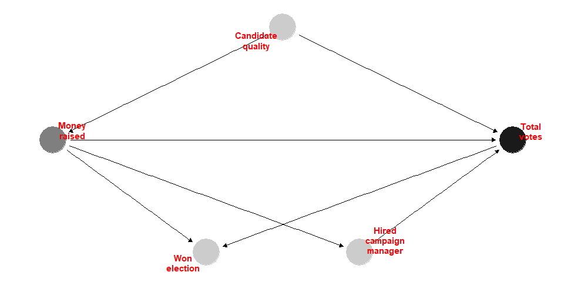
  
  - DAG for nets
    
    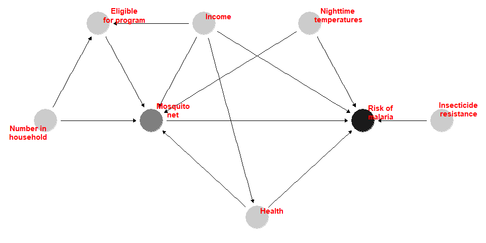
    
    - Control variables?
    - Do we need to control `eligible` and `household`

#### Conditional Independence

- $\text{Health}\perp\text{Numb. of Household}$

```r
cor(nets$health, nets$household)
```

```
## [1] 9.785337e-05
```

- $\text{Income}\perp\text{Insect Resistance}$

```r
cor(nets$income, nets$resistance)
```

```
## [1] 0.01371297
```

- $\text{Malaria risk}\perp\text{Numb. of Household} \mid \text{(Net Use, Health, Income, Temp)}$

```r
lm(malaria_risk ~ household + net + health + income + temperature,
   data = nets) %>%
  (function(x) summary(x)$coeff) %>%
  (function(x) round(x, 4))
```

```
##             Estimate Std. Error  t value Pr(>|t|)
## (Intercept)  76.2067     0.9658  78.9062   0.0000
## household    -0.0155     0.0893  -0.1730   0.8626
## netTRUE     -10.4370     0.2665 -39.1633   0.0000
## health        0.1483     0.0107  13.8997   0.0000
## income       -0.0751     0.0010 -72.5635   0.0000
## temperature   1.0058     0.0310  32.4829   0.0000
```

**Notes:** No correlation ⇏ Independence

> [Example] Flip a fair coin to determine the amount of your bet: bet \$1 if heads \\$2 if tails. Then flip again: win the amount of your bet if heads lose if tails.

### Naive Comparison

```r
model_naive <- lm(malaria_risk ~ net, data = nets) 
summary(model_naive)
```

```
## 
## Call:
## lm(formula = malaria_risk ~ net, data = nets)
## 
## Residuals:
##     Min      1Q  Median      3Q     Max 
## -26.937  -9.605  -1.937   7.063  55.395 
## 
## Coefficients:
##             Estimate Std. Error t value Pr(>|t|)    
## (Intercept)  41.9365     0.4049  103.57   <2e-16 ***
## netTRUE     -16.3315     0.6495  -25.15   <2e-16 ***
## ---
## Signif. codes:  0 '***' 0.001 '**' 0.01 '*' 0.05 '.' 0.1 ' ' 1
## 
## Residual standard error: 13.25 on 1750 degrees of freedom
## Multiple R-squared:  0.2654, Adjusted R-squared:  0.265 
## F-statistic: 632.3 on 1 and 1750 DF,  p-value: < 2.2e-16
```

#### Balance Check

```r
for (v in c('income', 'temperature', 'health')) {
  plot_command <- paste0('ggplot(data = nets, aes(x =', v,
                         ', fill=net)) +geom_density(alpha = 0.7)')
  print(eval(parse(text = plot_command)))
  test_result <- t.test(as.formula(paste0(v, '~net')), data=nets)
  print(test_result)
}
```

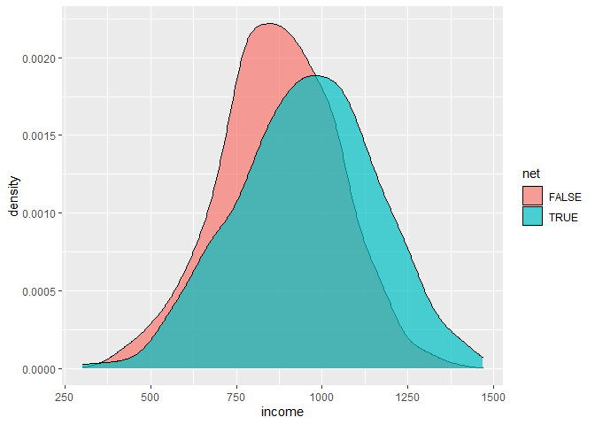

```
## 
##  Welch Two Sample t-test
## 
## data:  income by net
## t = -8.8113, df = 1284.7, p-value < 2.2e-16
## alternative hypothesis: true difference in means between group FALSE and group TRUE is not equal to 0
## 95 percent confidence interval:
##  -100.79660  -64.08593
## sample estimates:
## mean in group FALSE  mean in group TRUE 
##            872.7526            955.1938
```

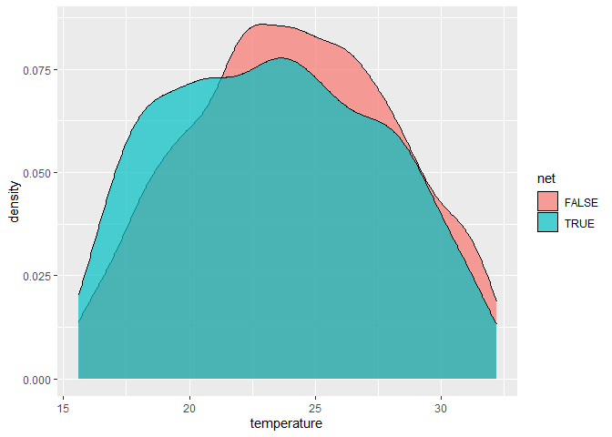

```
## 
##  Welch Two Sample t-test
## 
## data:  temperature by net
## t = 3.492, df = 1404.3, p-value = 0.0004943
## alternative hypothesis: true difference in means between group FALSE and group TRUE is not equal to 0
## 95 percent confidence interval:
##  0.3098586 1.1042309
## sample estimates:
## mean in group FALSE  mean in group TRUE 
##            24.08796            23.38091
```

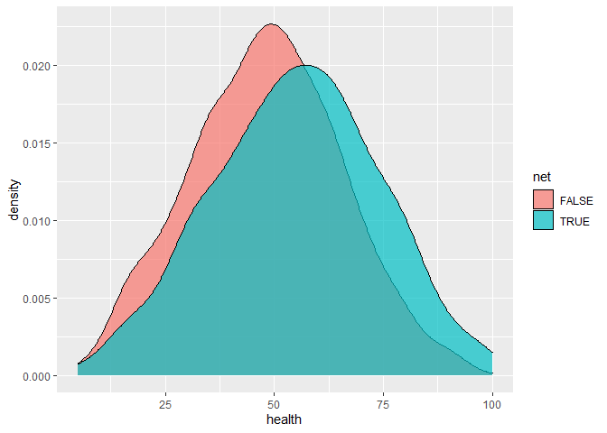

```
## 
##  Welch Two Sample t-test
## 
## data:  health by net
## t = -7.6447, df = 1346.9, p-value = 3.961e-14
## alternative hypothesis: true difference in means between group FALSE and group TRUE is not equal to 0
## 95 percent confidence interval:
##  -8.610309 -5.093693
## sample estimates:
## mean in group FALSE  mean in group TRUE 
##            48.05696            54.90896
```

### Regression

```r
model_regression <- lm(malaria_risk ~ net + income + temperature + health, data = nets)
summary(model_regression)
```

```
## 
## Call:
## lm(formula = malaria_risk ~ net + income + temperature + health, 
##     data = nets)
## 
## Residuals:
##     Min      1Q  Median      3Q     Max 
## -13.143  -3.915  -0.561   3.333  16.461 
## 
## Coefficients:
##               Estimate Std. Error t value Pr(>|t|)    
## (Intercept)  76.159901   0.926835   82.17   <2e-16 ***
## netTRUE     -10.441932   0.264906  -39.42   <2e-16 ***
## income       -0.075144   0.001035  -72.58   <2e-16 ***
## temperature   1.005855   0.030953   32.50   <2e-16 ***
## health        0.148362   0.010668   13.91   <2e-16 ***
## ---
## Signif. codes:  0 '***' 0.001 '**' 0.01 '*' 0.05 '.' 0.1 ' ' 1
## 
## Residual standard error: 5.244 on 1747 degrees of freedom
## Multiple R-squared:  0.8852, Adjusted R-squared:  0.8849 
## F-statistic:  3366 on 4 and 1747 DF,  p-value: < 2.2e-16
```

### Matching (Mahalanobis Distance)

- Mahalanobis distance between $\bf{x}$ and $\bf{y}$
  
  $$
  (\bf{x} - \bf{y})\Sigma^{-1}(\bf{x} - \bf{y})^T
  $$
  
  where $\Sigma$ is the covariance matrix.

```r
library(MatchIt)

matched <- matchit(net ~ income + temperature + health, data = nets,
                   method = "nearest", 
                   distance = "mahalanobis", 
                   replace = TRUE)
matched
```

```
## A matchit object
##  - method: 1:1 nearest neighbor matching with replacement
##  - distance: Mahalanobis
##  - number of obs.: 1752 (original), 1120 (matched)
##  - target estimand: ATT
##  - covariates: income, temperature, health
```

```r
# Dimension of the data used for matching
dim(matched$X)
```

```
## [1] 1752    3
```

```r
# Number of the treated
sum(matched$treat)
```

```
## [1] 681
```

```r
# Number of the matched control
sum(matched$weights>0)
```

```
## [1] 1120
```

```r
# Number of the unmatched control
sum(matched$weights==0)
```

```
## [1] 632
```

- The `matchit()` function determines the pair weights by measuring how close the matched pair are. The weights can be used in the regression to account for the variation in distance.

```r
nets_matched <- match.data(matched)
model_matched <- lm(malaria_risk ~ net, data = nets_matched, weights = weights)
summary(model_matched)
```

```
## 
## Call:
## lm(formula = malaria_risk ~ net, data = nets_matched, weights = weights)
## 
## Weighted Residuals:
##     Min      1Q  Median      3Q     Max 
## -36.312  -7.605  -1.681   5.395  55.395 
## 
## Coefficients:
##             Estimate Std. Error t value Pr(>|t|)    
## (Intercept)  36.0940     0.5951   60.65   <2e-16 ***
## netTRUE     -10.4890     0.7632  -13.74   <2e-16 ***
## ---
## Signif. codes:  0 '***' 0.001 '**' 0.01 '*' 0.05 '.' 0.1 ' ' 1
## 
## Residual standard error: 12.47 on 1118 degrees of freedom
## Multiple R-squared:  0.1445, Adjusted R-squared:  0.1438 
## F-statistic: 188.9 on 1 and 1118 DF,  p-value: < 2.2e-16
```

#### Balance Check

```r
for (v in c('income', 'temperature', 'health')) {
  test_result <- t.test(as.formula(paste0(v, '~net')), data=nets_matched)
  print(test_result)
}
```

```
## 
##  Welch Two Sample t-test
## 
## data:  income by net
## t = -3.5017, df = 990.87, p-value = 0.0004829
## alternative hypothesis: true difference in means between group FALSE and group TRUE is not equal to 0
## 95 percent confidence interval:
##  -64.12955 -18.06677
## sample estimates:
## mean in group FALSE  mean in group TRUE 
##            914.0957            955.1938 
## 
## 
##  Welch Two Sample t-test
## 
## data:  temperature by net
## t = 0.79239, df = 952.76, p-value = 0.4283
## alternative hypothesis: true difference in means between group FALSE and group TRUE is not equal to 0
## 95 percent confidence interval:
##  -0.2955968  0.6959627
## sample estimates:
## mean in group FALSE  mean in group TRUE 
##            23.58109            23.38091 
## 
## 
##  Welch Two Sample t-test
## 
## data:  health by net
## t = -3.0287, df = 977.39, p-value = 0.002521
## alternative hypothesis: true difference in means between group FALSE and group TRUE is not equal to 0
## 95 percent confidence interval:
##  -5.567087 -1.189325
## sample estimates:
## mean in group FALSE  mean in group TRUE 
##            51.53075            54.90896
```

### Matching (Propensity Score)

**Other Source**：[Simon Ejdemyr's notes on propensity score matching](https://sejdemyr.github.io/r-tutorials/statistics/tutorial8.html)

```r
matched_psm <- matchit(net ~ income + temperature + health, data = nets,
                   method = "nearest",
                   replace = TRUE)
matched_psm
```

```
## A matchit object
##  - method: 1:1 nearest neighbor matching with replacement
##  - distance: Propensity score
##              - estimated with logistic regression
##  - number of obs.: 1752 (original), 1098 (matched)
##  - target estimand: ATT
##  - covariates: income, temperature, health
```

```r
nets_matched_psm <- match.data(matched_psm)
model_matched_psm <- lm(malaria_risk ~ net, data = nets_matched_psm, weights = weights)
summary(model_matched_psm)
```

```
## 
## Call:
## lm(formula = malaria_risk ~ net, data = nets_matched_psm, weights = weights)
## 
## Weighted Residuals:
##     Min      1Q  Median      3Q     Max 
## -57.745  -7.605  -1.605   5.395  59.226 
## 
## Coefficients:
##             Estimate Std. Error t value Pr(>|t|)    
## (Intercept)  36.3025     0.6187   58.67   <2e-16 ***
## netTRUE     -10.6975     0.7857  -13.62   <2e-16 ***
## ---
## Signif. codes:  0 '***' 0.001 '**' 0.01 '*' 0.05 '.' 0.1 ' ' 1
## 
## Residual standard error: 12.63 on 1096 degrees of freedom
## Multiple R-squared:  0.1447, Adjusted R-squared:  0.1439 
## F-statistic: 185.4 on 1 and 1096 DF,  p-value: < 2.2e-16
```

#### Common Support

```r
model_treatment <- glm(net ~ income + temperature + health, data = nets,
                       family = binomial(link = "logit"))
nets_pred <- copy(nets)
nets_pred$pred <- model_treatment$fitted.values

ggplot(data = nets_pred, aes(x = pred, fill=net)) + 
  geom_histogram(position = "identity", alpha = 0.7, bins = 50) + xlim(c(0, 1)) + 
  labs(title=paste0('Full Sample (N = ', nrow(nets_pred), ')'))
```

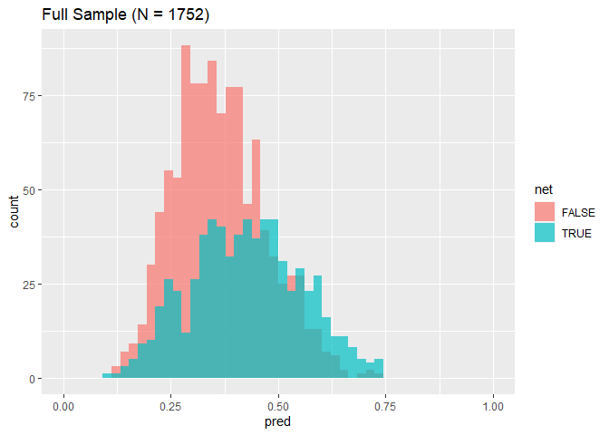

```r
ggplot(data = nets_pred[id %in% nets_matched_psm$id], aes(x = pred, fill=net)) + 
  geom_histogram(position = "identity", alpha = 0.7, bins = 50) + xlim(c(0, 1)) + 
  labs(title=paste0('Matched Sample (N = ', nrow(nets_matched_psm), ')'))
```

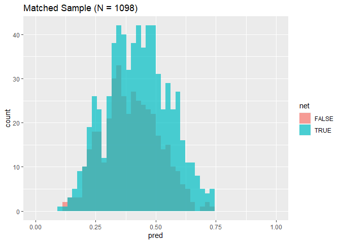

#### Balance Check

```r
for (v in c('income', 'temperature', 'health')) {
  plot_command <- paste0('ggplot(data = nets_matched_psm, aes(x =', v,
                         ', fill=net)) +geom_density(alpha = 0.7)')
  print(eval(parse(text = plot_command)))
  test_result <- t.test(as.formula(paste0(v, '~net')), data=nets_matched_psm)
  print(test_result)
}
```

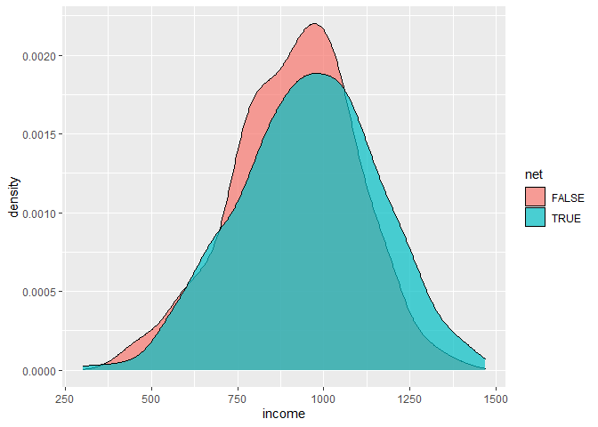

```
## 
##  Welch Two Sample t-test
## 
## data:  income by net
## t = -3.548, df = 954.79, p-value = 0.0004071
## alternative hypothesis: true difference in means between group FALSE and group TRUE is not equal to 0
## 95 percent confidence interval:
##  -64.64167 -18.59971
## sample estimates:
## mean in group FALSE  mean in group TRUE 
##            913.5731            955.1938
```


```
## 
##  Welch Two Sample t-test
## 
## data:  temperature by net
## t = 1.4522, df = 910.52, p-value = 0.1468
## alternative hypothesis: true difference in means between group FALSE and group TRUE is not equal to 0
## 95 percent confidence interval:
##  -0.1294926  0.8664727
## sample estimates:
## mean in group FALSE  mean in group TRUE 
##            23.74940            23.38091
```

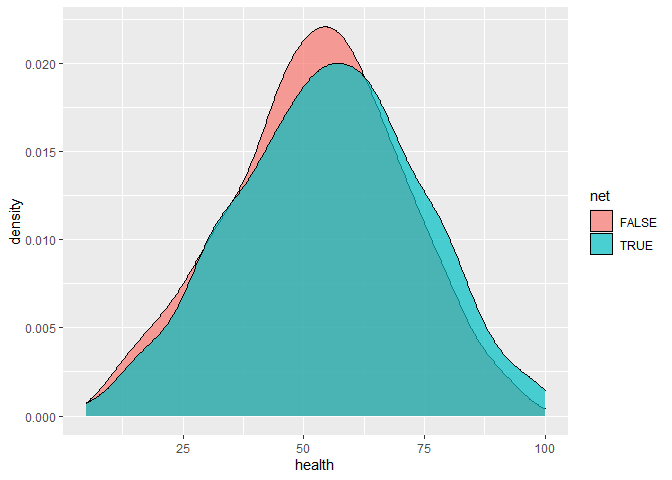

```
## 
##  Welch Two Sample t-test
## 
## data:  health by net
## t = -2.1015, df = 920.12, p-value = 0.03587
## alternative hypothesis: true difference in means between group FALSE and group TRUE is not equal to 0
## 95 percent confidence interval:
##  -4.6145611 -0.1577902
## sample estimates:
## mean in group FALSE  mean in group TRUE 
##            52.52278            54.90896
```

### Inverse Probability Weighting

```r
# Predict the probability of a household using bed nets
model_treatment <- glm(net ~ income + temperature + health, data = nets,
                       family = binomial(link = "logit"))
nets_ipw <- copy(nets)
nets_ipw$pred <- model_treatment$fitted.values
nets_ipw[, ipw := (net_num / pred) + (1 - net_num) / (1 - pred)]

# Evaluate the effect with inverse probability weights
model_ipw <- lm(malaria_risk ~ net, data = nets_ipw, weights = ipw)
summary(model_ipw)
```

```
## 
## Call:
## lm(formula = malaria_risk ~ net, data = nets_ipw, weights = ipw)
## 
## Weighted Residuals:
##     Min      1Q  Median      3Q     Max 
## -45.705 -14.622  -4.924  10.791 162.642 
## 
## Coefficients:
##             Estimate Std. Error t value Pr(>|t|)    
## (Intercept)  39.6788     0.4684   84.71   <2e-16 ***
## netTRUE     -10.1312     0.6583  -15.39   <2e-16 ***
## ---
## Signif. codes:  0 '***' 0.001 '**' 0.01 '*' 0.05 '.' 0.1 ' ' 1
## 
## Residual standard error: 19.54 on 1750 degrees of freedom
## Multiple R-squared:  0.1192, Adjusted R-squared:  0.1187 
## F-statistic: 236.8 on 1 and 1750 DF,  p-value: < 2.2e-16
```

- Inverse Probability Weights
  
  $$
  \frac{\text{Treatment}}{\text{Propensity}}+\frac{1-\text{Treatment}}{1-\text{Propensity}}
  $$
  
  Think of this formula in a controlled experiment scenario:
  
  - Individuals are more likely to be **never-takers** (in a control group) if their likelihood values of receiving treatment are lower than the average and they do *not* receive treatment
  
  - Individuals are more likely to be **always-takers** (in a treatment group) if their likelihood values of receiving treatment are higher than the average and they *do* receive treatment
  
  - Individuals are more likely to be **compliers** (in both the control and the treatment group) if their likelihood values of receiving treatment are inconsistent with their actual treatment

To the end, we evaluate the change in the compliers' outcomes due to their different exposures to the treatment.

### Results

```
## 
## ===============================================================================
##              Naive        Regression   Matching (M)  Matching (PS)  IPW        
## -------------------------------------------------------------------------------
## (Intercept)    41.94 ***    76.16 ***    36.09 ***     36.30 ***      39.68 ***
##                (0.40)       (0.93)       (0.60)        (0.62)         (0.47)   
## netTRUE       -16.33 ***   -10.44 ***   -10.49 ***    -10.70 ***     -10.13 ***
##                (0.65)       (0.26)       (0.76)        (0.79)         (0.66)   
## income                      -0.08 ***                                          
##                             (0.00)                                             
## temperature                  1.01 ***                                          
##                             (0.03)                                             
## health                       0.15 ***                                          
##                             (0.01)                                             
## -------------------------------------------------------------------------------
## R^2             0.27         0.89         0.14          0.14           0.12    
## Adj. R^2        0.27         0.88         0.14          0.14           0.12    
## Num. obs.    1752         1752         1120          1098           1752       
## ===============================================================================
## *** p < 0.001; ** p < 0.01; * p < 0.05
```

- Overestimate or underestimate? Why?
  
  Suppose $y = \beta x + \theta z + \varepsilon$ where $z$ is an omitting variable.
  
  $$
  \begin{align*}~
z &= \gamma x+\eta \\\\
y &= \beta x +\xi = \beta x + \theta\gamma x +\theta\eta+\epsilon
\end{align*}
  $$
  
  where $\beta'=\beta+\theta\gamma\neq\beta$ if $\theta\neq0$ or $\gamma\neq0$.

## Practice 3: Difference-in-differences

```r
injury <- fread("Did/injury.csv")[ky==1]
setnames(injury, old=c('durat', 'ldurat', 'afchnge'),
         new=c('duration', 'log_duration', 'after_1980'))
injury$highearn <- injury$highearn==1
print(paste(c('Number of Rows:', 'Number of Columns:'), dim(injury)))
```

    ## [1] "Number of Rows: 5626"  "Number of Columns: 30"

```r
head(injury)
```

    ##    duration after_1980 highearn male married hosp indust injtype age  prewage    totmed injdes  benefit ky mi log_duration afhigh lprewage     lage  ltotmed head neck upextr trunk lowback lowextr occdis manuf construc highlpre
    ## 1:        1          1     TRUE    1       0    1      3       1  26 404.9500 1187.5732   1010 246.8375  1  0     0.000000      1 6.003764 3.258096 7.079667    1    0      0     0       0       0      0     0        0 6.003764
    ## 2:        1          1     TRUE    1       1    0      3       1  31 643.8250  361.0786   1404 246.8375  1  0     0.000000      1 6.467427 3.433987 5.889095    1    0      0     0       0       0      0     0        0 6.467427
    ## 3:       84          1     TRUE    1       1    1      3       1  37 398.1250 8963.6572   1032 246.8375  1  0     4.430817      1 5.986766 3.610918 9.100934    1    0      0     0       0       0      0     0        0 5.986766
    ## 4:        4          1     TRUE    1       1    1      3       1  31 527.8000 1099.6483   1940 246.8375  1  0     1.386294      1 6.268717 3.433987 7.002746    1    0      0     0       0       0      0     0        0 6.268717
    ## 5:        1          1     TRUE    1       1    0      3       1  23 528.9375  372.8019   1940 211.5750  1  0     0.000000      1 6.270870 3.135494 5.921047    1    0      0     0       0       0      0     0        0 6.270870
    ## 6:        1          1     TRUE    1       1    0      3       1  34 614.2500  211.0199   1425 176.3125  1  0     0.000000      1 6.420402 3.526361 5.351953    1    0      0     0       0       0      0     0        0 6.420402

> Background (Wooldridge’s Intro Econometrics P411): Meyer, Viscusi, and Durbin (1995) (hereafter, MVD) studied the length of time (in weeks) that an injured worker receives workers’ compensation. On July 15, 1980, Kentucky raised the cap on weekly earnings that were covered by workers’ compensation. An increase in the cap has no effect on the benefit for low-income workers, but it makes it less costly for a high-income worker to stay on workers’ compensation. Therefore, the control group is low-income workers, and the treatment group is high-income workers; high-income workers are defined as those who were subject to the pre-policy change cap. Using random samples both before and after the policy change, MVD were able to test whether more generous workers’ compensation causes people to stay out of work longer (everything else fixed). They started with a difference-in-differences analysis, using log(durat) as the dependent variable. Let afchnge be the dummy variable for observations after the policy change and highearn the dummy variable for high earners.

### Change after 1980

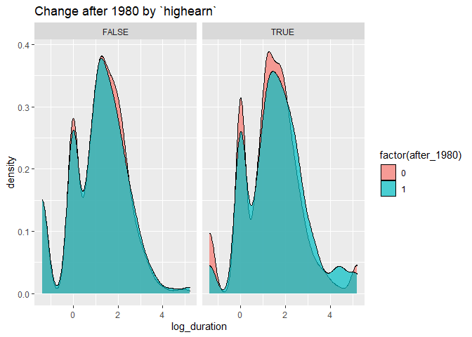

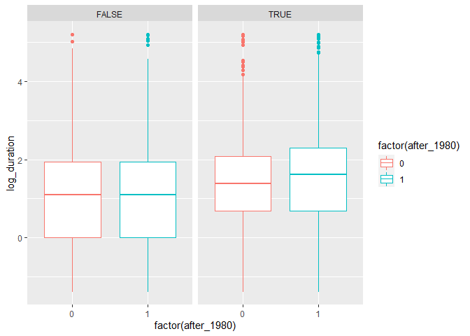

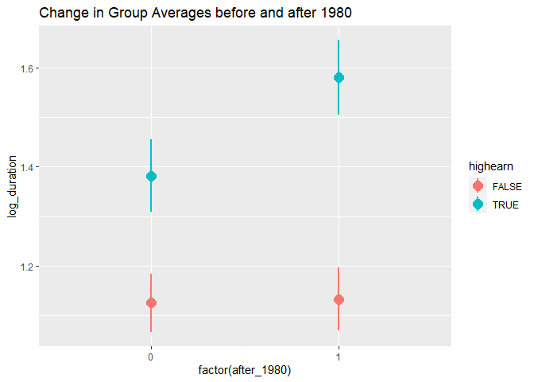

### Regression

$$
\log(\text{duration}) = \alpha + \beta \text{highearn} +
\gamma\text{after\_1980} +
\delta(\text{highearn} \times \text{after\_1980}) + \epsilon
$$

```r
model_simple <- lm(log_duration ~ highearn + after_1980 + highearn * after_1980,
                   data = injury)
summary(model_simple)
```

    ## 
    ## Call:
    ## lm(formula = log_duration ~ highearn + after_1980 + highearn * 
    ##     after_1980, data = injury)
    ## 
    ## Residuals:
    ##     Min      1Q  Median      3Q     Max 
    ## -2.9666 -0.8872  0.0042  0.8126  4.0784 
    ## 
    ## Coefficients:
    ##                         Estimate Std. Error t value Pr(>|t|)    
    ## (Intercept)             1.125615   0.030737  36.621  < 2e-16 ***
    ## highearnTRUE            0.256479   0.047446   5.406 6.72e-08 ***
    ## after_1980              0.007657   0.044717   0.171  0.86404    
    ## highearnTRUE:after_1980 0.190601   0.068509   2.782  0.00542 ** 
    ## ---
    ## Signif. codes:  0 '***' 0.001 '**' 0.01 '*' 0.05 '.' 0.1 ' ' 1
    ## 
    ## Residual standard error: 1.269 on 5622 degrees of freedom
    ## Multiple R-squared:  0.02066,    Adjusted R-squared:  0.02014 
    ## F-statistic: 39.54 on 3 and 5622 DF,  p-value: < 2.2e-16

**Add more controls**: `male`, `married`, `age`, `hosp` (1 = hospitalized), `indust` (1 = manuf, 2 = construc, 3 = other), `injtype` (1-8; categories for different types of injury), `lprewage` (log of wage prior to filing a claim)

```r
model_full <- lm(log_duration ~ highearn + after_1980 + highearn * after_1980 + male + 
                   married + age + hosp + as.factor(indust) + as.factor(injtype) + lprewage,
                 data = injury)
summary(model_full)
```

    ## 
    ## Call:
    ## lm(formula = log_duration ~ highearn + after_1980 + highearn * 
    ##     after_1980 + male + married + age + hosp + as.factor(indust) + 
    ##     as.factor(injtype) + lprewage, data = injury)
    ## 
    ## Residuals:
    ##     Min      1Q  Median      3Q     Max 
    ## -4.0606 -0.7726  0.0931  0.7314  4.3409 
    ## 
    ## Coefficients:
    ##                          Estimate Std. Error t value Pr(>|t|)    
    ## (Intercept)             -1.528202   0.422212  -3.620 0.000298 ***
    ## highearnTRUE            -0.151781   0.089116  -1.703 0.088591 .  
    ## after_1980               0.049540   0.041321   1.199 0.230624    
    ## male                    -0.084289   0.042315  -1.992 0.046427 *  
    ## married                  0.056662   0.037305   1.519 0.128845    
    ## age                      0.006507   0.001338   4.863 1.19e-06 ***
    ## hosp                     1.130493   0.037006  30.549  < 2e-16 ***
    ## as.factor(indust)2       0.183864   0.054131   3.397 0.000687 ***
    ## as.factor(indust)3       0.163485   0.037852   4.319 1.60e-05 ***
    ## as.factor(injtype)2      0.935468   0.143731   6.508 8.29e-11 ***
    ## as.factor(injtype)3      0.635466   0.085442   7.437 1.19e-13 ***
    ## as.factor(injtype)4      0.554550   0.092849   5.973 2.49e-09 ***
    ## as.factor(injtype)5      0.641201   0.085435   7.505 7.15e-14 ***
    ## as.factor(injtype)6      0.615041   0.086312   7.126 1.17e-12 ***
    ## as.factor(injtype)7      0.991336   0.190532   5.203 2.03e-07 ***
    ## as.factor(injtype)8      0.434082   0.118912   3.650 0.000264 ***
    ## lprewage                 0.284481   0.080056   3.554 0.000383 ***
    ## highearnTRUE:after_1980  0.168721   0.063975   2.637 0.008381 ** 
    ## ---
    ## Signif. codes:  0 '***' 0.001 '**' 0.01 '*' 0.05 '.' 0.1 ' ' 1
    ## 
    ## Residual standard error: 1.15 on 5329 degrees of freedom
    ##   (279 observations deleted due to missingness)
    ## Multiple R-squared:  0.1899, Adjusted R-squared:  0.1873 
    ## F-statistic: 73.46 on 17 and 5329 DF,  p-value: < 2.2e-16

**Summary**

    ## 
    ## =================================================
    ##                          Simple       Full       
    ## -------------------------------------------------
    ## (Intercept)                 1.13 ***    -1.53 ***
    ##                            (0.03)       (0.42)   
    ## highearnTRUE                0.26 ***    -0.15    
    ##                            (0.05)       (0.09)   
    ## after_1980                  0.01         0.05    
    ##                            (0.04)       (0.04)   
    ## highearnTRUE:after_1980     0.19 **      0.17 ** 
    ##                            (0.07)       (0.06)   
    ## -------------------------------------------------
    ## Additional Controls        NO          YES       
    ## R^2                         0.02         0.19    
    ## Adj. R^2                    0.02         0.19    
    ## Num. obs.                5626         5347       
    ## =================================================
    ## *** p < 0.001; ** p < 0.01; * p < 0.05