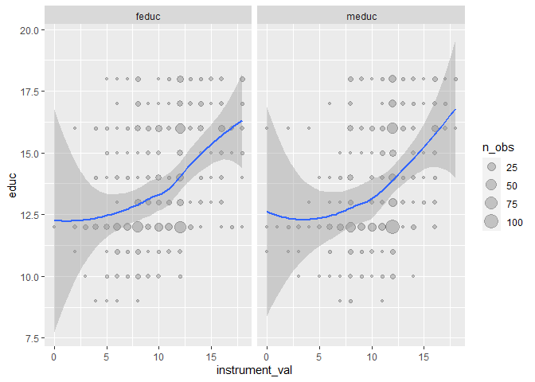
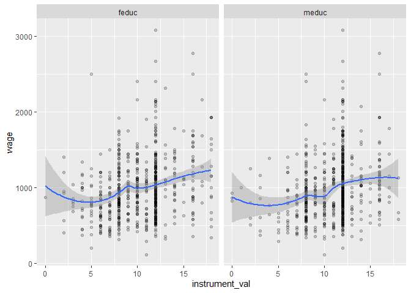
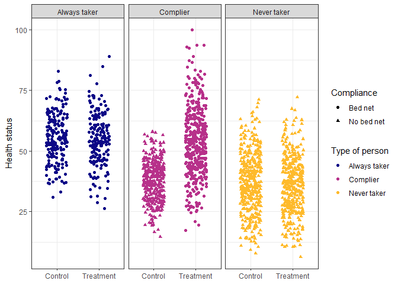
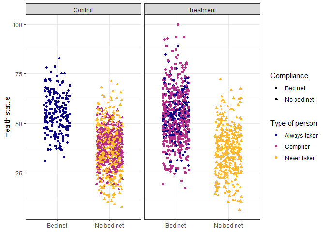

## Practice 4: Instrumental Variables

```r
wage <- fread("IV/wage2.csv")
ed_real <- na.omit(wage)
print(paste(c('Number of Rows:', 'Number of Columns:'), dim(ed_real)))
```

```
## [1] "Number of Rows: 663"   "Number of Columns: 17"
```

```r
head(ed_real)
```

```
##    wage hours  IQ KWW educ exper tenure age married black south urban sibs brthord meduc feduc    lwage
## 1:  769    40  93  35   12    11      2  31       1     0     0     1    1       2     8     8 6.645091
## 2:  825    40 108  46   14    11      9  33       1     0     0     1    1       2    14    14 6.715384
## 3:  650    40  96  32   12    13      7  32       1     0     0     1    4       3    12    12 6.476973
## 4:  562    40  74  27   11    14      5  34       1     0     0     1   10       6     6    11 6.331502
## 5:  600    40  91  24   10    13      0  30       0     0     0     1    1       2     8     8 6.396930
## 6: 1154    45 111  37   15    13      1  36       1     0     0     0    2       3    14     5 7.050990
```

### Navie Model

```r
model_naive <- lm(wage ~ educ + hours + exper + tenure + age + married + black + 
                    south + urban + sibs + brthord, data = ed_real)
summary(model_naive)
```

```
## 
## Call:
## lm(formula = wage ~ educ + hours + exper + tenure + age + married + 
##     black + south + urban + sibs + brthord, data = ed_real)
## 
## Residuals:
##     Min      1Q  Median      3Q     Max 
## -760.19 -232.71  -47.58  175.86 2030.93 
## 
## Coefficients:
##             Estimate Std. Error t value Pr(>|t|)    
## (Intercept) -393.560    200.607  -1.962 0.050205 .  
## educ          61.384      7.661   8.012 5.22e-15 ***
## hours         -4.205      1.976  -2.128 0.033708 *  
## exper          9.764      4.532   2.154 0.031579 *  
## tenure         3.480      2.954   1.178 0.239141    
## age           10.659      5.575   1.912 0.056326 .  
## married      182.178     47.054   3.872 0.000119 ***
## black       -170.437     54.618  -3.121 0.001885 ** 
## south        -38.523     31.098  -1.239 0.215878    
## urban        192.487     31.701   6.072 2.15e-09 ***
## sibs           4.399      7.983   0.551 0.581767    
## brthord      -22.558     11.694  -1.929 0.054167 .  
## ---
## Signif. codes:  0 '***' 0.001 '**' 0.01 '*' 0.05 '.' 0.1 ' ' 1
## 
## Residual standard error: 359.3 on 651 degrees of freedom
## Multiple R-squared:  0.2319, Adjusted R-squared:  0.2189 
## F-statistic: 17.87 on 11 and 651 DF,  p-value: < 2.2e-16
```

### Check Instrument Validity

1. Relevance: The instrument is correlated with the endogenous variable
2. Exclusion: Instrument is correlated with the outcome only through the endogenous variable
3. Exogeneity: The instrument is exogenous; in other words, it is NOT correlated with omitting variables

**Relevance**

```r
ed_real_long <- melt(ed_real[, .(educ, feduc, meduc)],
                     id.vars = c('educ'), measure.vars = c('feduc', 'meduc'),
                     variable.name = 'instrument', value.name = 'instrument_val')
ed_real_long <- ed_real_long[, .(n_obs = .N)
                             , by = c('educ', 'instrument', 'instrument_val')]

ggplot(ed_real_long, aes(x=instrument_val, y = educ)) + 
  geom_point(aes(size=n_obs), alpha = 0.2) +
  geom_smooth(aes(weight=n_obs), method = 'loess', formula = 'y ~ x') +
  facet_wrap(vars(instrument))
```



```r
model_check_instruments <- lm(educ ~ feduc + meduc, data = ed_real)
summary(model_check_instruments)
```

```
## 
## Call:
## lm(formula = educ ~ feduc + meduc, data = ed_real)
## 
## Residuals:
##     Min      1Q  Median      3Q     Max 
## -4.2226 -1.5658 -0.4271  1.7373  5.7305 
## 
## Coefficients:
##             Estimate Std. Error t value Pr(>|t|)    
## (Intercept)  9.91329    0.31959  31.019  < 2e-16 ***
## feduc        0.21894    0.02889   7.578 1.19e-13 ***
## meduc        0.14017    0.03365   4.165 3.52e-05 ***
## ---
## Signif. codes:  0 '***' 0.001 '**' 0.01 '*' 0.05 '.' 0.1 ' ' 1
## 
## Residual standard error: 1.997 on 660 degrees of freedom
## Multiple R-squared:  0.2015, Adjusted R-squared:  0.1991 
## F-statistic: 83.29 on 2 and 660 DF,  p-value: < 2.2e-16
```

**Exclusion**

1. Check the relationship between the instruments and the outcome, i.e., wages (we should see some relationship)
2. Argue the relationship is built on the path through the endogenous variable, i.e., education

```r
ed_real_long <- melt(ed_real[, .(wage, feduc, meduc)],
                     id.vars = c('wage'), measure.vars = c('feduc', 'meduc'),
                     variable.name = 'instrument', value.name = 'instrument_val')

ggplot(ed_real_long, aes(x=instrument_val, y = wage)) + 
  geom_point(alpha = 0.2) +
  geom_smooth(method = 'loess', formula = 'y ~ x') +
  facet_wrap(vars(instrument))
```



**Exogeneity**

There's no statistical test for exogeneity.

Scott Cunningham's argument

> The reason I think this is because an instrument doesn’t belong in the structural error term and the structural error term is all the intuitive things that determine your outcome. So *it must be weird, otherwise it's probably in the error term.*

### 2-Stage Least Squares (2SLS)

```r
# Conduct 2SLS manually
first_stage <- lm(educ ~ feduc + meduc + hours + exper + tenure + age +
                    married + black + south + urban + sibs + brthord, data = ed_real)
ed_real_with_pred <- copy(ed_real)
ed_real_with_pred$educ_hat <- first_stage$fitted.values
second_stage <- lm(wage ~ educ_hat + hours + exper + tenure + age +
                     married + black + south + urban + sibs + brthord, data = ed_real_with_pred)

# Conduct 2SLS automatically
model_2sls <- estimatr::iv_robust(wage ~ educ + hours + exper + tenure + age + 
                                    married + black + south + urban + sibs + brthord | 
                                    feduc + meduc + hours + exper + tenure + age + 
                                    married + black + south + urban + sibs + brthord, 
                                  data = ed_real, diagnostics = TRUE)
```

**Summary**

```
## 
## ============================================================
##              Naive OLS    2SLS (Manual)  2SLS (Auto)        
## ------------------------------------------------------------
## (Intercept)  -393.56      -1064.47 ***    -1064.47 *        
##              (200.61)      (302.54)      [-1680.71; -448.23]
## educ           61.38 ***                    127.86 *        
##                (7.66)                    [   83.31;  172.40]
## educ_hat                    127.86 ***                      
##                             (23.35)                         
## ------------------------------------------------------------
## Controls      YES           YES             YES             
## R^2             0.23          0.19            0.14          
## Adj. R^2        0.22          0.18            0.13          
## Num. obs.     663           663             663             
## RMSE                                        379.48          
## ============================================================
## *** p < 0.001; ** p < 0.01; * p < 0.05 (or Null hypothesis value outside the confidence interval).
```

```r
summary(model_2sls)
```

```
## 
## Call:
## estimatr::iv_robust(formula = wage ~ educ + hours + exper + tenure + 
##     age + married + black + south + urban + sibs + brthord | 
##     feduc + meduc + hours + exper + tenure + age + married + 
##         black + south + urban + sibs + brthord, data = ed_real, 
##     diagnostics = TRUE)
## 
## Standard error type:  HC2 
## 
## Coefficients:
##              Estimate Std. Error t value  Pr(>|t|)  CI Lower CI Upper  DF
## (Intercept) -1064.471    313.829 -3.3919 7.362e-04 -1680.709 -448.232 651
## educ          127.858     22.686  5.6360 2.594e-08    83.311  172.404 651
## hours          -4.416      2.780 -1.5885 1.127e-01    -9.875    1.043 651
## exper          30.677      8.439  3.6352 2.997e-04    14.106   47.248 651
## tenure          1.976      3.103  0.6366 5.246e-01    -4.118    8.069 651
## age            -4.171      8.052 -0.5180 6.046e-01   -19.982   11.640 651
## married       195.132     47.632  4.0967 4.720e-05   101.602  288.663 651
## black        -148.117     47.498 -3.1184 1.898e-03  -241.385  -54.850 651
## south         -32.697     33.067 -0.9888 3.231e-01   -97.627   32.233 651
## urban         167.666     31.920  5.2527 2.033e-07   104.988  230.345 651
## sibs           12.351      8.757  1.4104 1.589e-01    -4.845   29.547 651
## brthord       -16.887     11.608 -1.4547 1.462e-01   -39.681    5.907 651
## 
## Multiple R-squared:  0.143 , Adjusted R-squared:  0.1286 
## F-statistic: 16.88 on 11 and 651 DF,  p-value: < 2.2e-16
## 
## Diagnostics:
##                  numdf dendf  value  p.value    
## Weak instruments     2   650 42.896  < 2e-16 ***
## Wu-Hausman           1   650 11.659 0.000679 ***
## Overidentifying      1    NA  0.104 0.747148    
## ---
## Signif. codes:  0 '***' 0.001 '**' 0.01 '*' 0.05 '.' 0.1 ' ' 1
```

**Notes**: A test of overidentifying restrictions regresses the residuals $u$ from an IV or 2SLS regression on all instruments in $z$. Under the **null** hypothesis, all instruments are uncorrelated with $u$.

The test of overidentifying restrictions should be performed routinely in any overidentified model estimated with instrumental variables techniques. Instrumental variables techniques are powerful, but if a strong rejection of the null hypothesis is encountered, you should strongly doubt the validity of the estimates.

## Practice 5: Complier Average Treatment Effects

We can calculate conditional average treatment effect (CATE) by averaging the treatment effect of a program over some segment of the population.

One important type of CATE is the effect of a program on just those who comply with the program. This is the complier average treatment effect, but the acronym would be the same as the conditional average treatment effect, so we call it the **complier average causal effect** (**CACE**), also known as the local average treatment effect (LATE).

We can split the population into four types of people:

- **Compliers**: People who follow whatever their assignment is
- **Always takers**: People who will receive or seek out the treatment regardless of assignment
- **Never takers**: People who will NOT receive or seek out the treatment regardless of assignment
- **Defiers**: People who will do the opposite of whatever their assignment is

For simplicity, we assume that defiers don’t exist based on the idea of *monotonicity*, which means that the effect of being assigned to treatment only increases the likelihood of participating in the program rather than decreases.

```r
bed_nets_time_machine <- fread("ITT&CACE/bed_nets_time_machine.csv")
```

Ideally, we can identify different types of people from the data.


However, we can tell some of the always takers from the control group (those who used bed nets after being assigned to the control group) and some of the never takers from the treatment group (those who did not use a bed net after being assigned to the treatment group), but compliers are mixed up with the always and never takers.


### Intent to Treat (ITT)

We can calculate ITT by assuming the proportion of compliers (c), never takers (n), and always takers (a) are equally spread across treatment and control. This assumption is plausible in a randomized control trial.

$$
\begin{align*}~
\text{ITT}\space=\space& \sum_{k\in\\{c,n,a\\}}\pi_k\times(\text{T}-\text{C})_k
\end{align*}
$$

Suppose treatment doesn’t make someone more likely to be an always taker or a never taker, we have $\text{ATACE}=0$ and $\text{NTACE}=0$. Hence,

$$
\text{ITT}=\pi_c\text{CACE} \implies \text{CACE} = \frac{\text{ITT}}{\pi_c}
$$

**Finding ITT Using regression**

```r
itt_model <- lm(health ~ treatment, data = bed_nets_time_machine)
summary(itt_model)$coeff %>%
  (function(x) round(x, 4))
```

```
##                    Estimate Std. Error t value Pr(>|t|)
## (Intercept)         40.9381     0.4444 92.1143        0
## treatmentTreatment   5.9880     0.6298  9.5081        0
```

### CACE/LATE

Given$ \text{ITT}$, we can calculate $\text{CACE/LATE}$ by obtaining $\pi_c$.

$$
\begin{align*}~
\pi_a+\pi_c &= \text{percent of yes in treatment} \\\\
\implies \pi_c&=\text{percent of yes in treatment} - \pi_a
\\\\ &=\text{percent of yes in treatment} - \text{percent of yes in control}
\end{align*}
$$

```r
table_net <- bed_nets_time_machine[, .N, by=c('treatment', 'bed_net')][
  order(treatment, bed_net)]
table_net[, percent:=round(N/sum(N), 4), by='treatment']
table_net
```

```
##    treatment    bed_net   N percent
## 1:   Control    Bed net 196  0.1952
## 2:   Control No bed net 808  0.8048
## 3: Treatment    Bed net 608  0.6104
## 4: Treatment No bed net 388  0.3896
```

```r
cACE <- itt_model$coef["treatmentTreatment"] / 
  (table_net[treatment == 'Treatment' & bed_net == 'Bed net']$percent - 
     table_net[treatment == 'Control' & bed_net == 'Bed net']$percent)
names(cACE) <- "CACE"
round(cACE, 2)
```

```
##  CACE 
## 14.42
```

#### IV Regression

```r
model_2sls <- estimatr::iv_robust(health ~ as.factor(bed_net) | as.factor(treatment),
                                  data = bed_nets_time_machine)
round(summary(model_2sls)$coef, 2)
```

```
##                              Estimate Std. Error t value Pr(>|t|) CI Lower
## (Intercept)                     52.54       0.84    62.2        0    50.89
## as.factor(bed_net)No bed net   -14.42       1.25   -11.5        0   -16.88
##                              CI Upper   DF
## (Intercept)                     54.20 1998
## as.factor(bed_net)No bed net   -11.96 1998
```
