## Practice 6: Regression Discontinuity - Sharp

Data in this example include student test scores from an entrance and an exit exam. Students who score 70 or below in the entrance exam are automatically enrolled in a free tutoring program and receive assistance throughout the year. At the end of the school year, students take an exit exam (with a maximum of 100 points) to measure how much they learned overall.

```r
tutoring <- fread("RD/tutoring_program.csv")
print(paste(c('Number of Rows:', 'Number of Columns:'), dim(tutoring)))
```

    ## [1] "Number of Rows: 1000" "Number of Columns: 4"

```r
head(tutoring)
```

    ##    id entrance_exam exit_exam tutoring
    ## 1:  1          92.4      78.1    FALSE
    ## 2:  2          72.8      58.2    FALSE
    ## 3:  3          53.7      62.0     TRUE
    ## 4:  4          98.3      67.5    FALSE
    ## 5:  5          69.7      54.1     TRUE
    ## 6:  6          68.1      60.1     TRUE

There are 5 steps in a causal study using regression discontinuity (RD)
technique:

**Step 1**: Determine if process of assigning treatment is rule based

**Step 2**: Determine if the design is fuzzy or sharp

**Step 3**: Check for discontinuity in running variable around cutpoint

**Step 4**: Check for discontinuity in outcome across running variable

**Step 5**: Measure the size of the effect

### Sharp or Fuzzy

Check in plot and verify in table
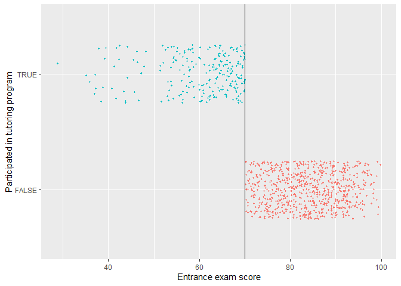

```r
tutoring[, .(group_min = min(entrance_exam), group_max = max(entrance_exam))
         , by = 'tutoring']
```

    ##    tutoring group_min group_max
    ## 1:    FALSE      70.1      99.8
    ## 2:     TRUE      28.8      70.0

We confirm that there is a sharp cutoff at 70.

### Manipulation Testing

Check if there was any manipulation in the running variable. For example, students wanted to enroll in the program, so they did poorly on the exam to get under 70 in purpose. First, we'll make a histogram of the running variable (test scores) and see if there are any big jumps around the threshold.

```r
ggplot(tutoring, aes(x = entrance_exam, fill = tutoring)) +
  geom_histogram(binwidth = 2, color = "white", boundary = 70) +
  geom_vline(xintercept = 70) +
  labs(x = "Entrance exam score", y = "Count", fill = "In program")
```

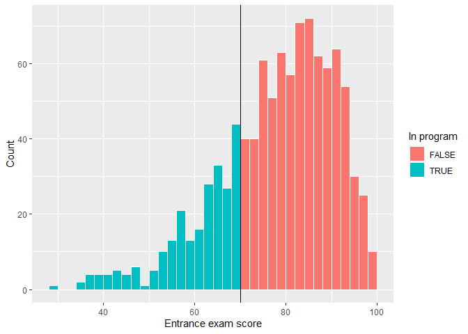

There's a tiny visible difference between the height of the bars right before and right after the score of 70. We can check to see if that jump is statistically significant with a McCrary density test. This puts data into bins like a histogram, and then plots the averages and confidence intervals of those bins. 

+ If the confidence intervals of the density lines don't overlap, then there's likely something systematically wrong with how the test was scored (i.e. too many people getting 69 vs 71). 

+ If the confidence intervals overlap, there's not any significant difference around the threshold and we're fine.

```r
test_density <- rddensity(tutoring$entrance_exam, c = 70)
summary(test_density)
```

    ## 
    ## Manipulation testing using local polynomial density estimation.
    ## 
    ## Number of obs =       1000
    ## Model =               unrestricted
    ## Kernel =              triangular
    ## BW method =           estimated
    ## VCE method =          jackknife
    ## 
    ## c = 70                Left of c           Right of c          
    ## Number of obs         237                 763                 
    ## Eff. Number of obs    208                 577                 
    ## Order est. (p)        2                   2                   
    ## Order bias (q)        3                   3                   
    ## BW est. (h)           22.444              19.966              
    ## 
    ## Method                T                   P > |T|             
    ## Robust                -0.5521             0.5809              
    ## 
    ## 
    ## P-values of binomial tests (H0: p=0.5).
    ## 
    ## Window Length / 2          <c     >=c    P>|T|
    ## 0.300                       9      11    0.8238
    ## 0.600                      15      16    1.0000
    ## 0.900                      17      19    0.8679
    ## 1.200                      22      22    1.0000
    ## 1.500                      26      29    0.7877
    ## 1.800                      34      35    1.0000
    ## 2.100                      41      44    0.8284
    ## 2.400                      43      51    0.4705
    ## 2.700                      46      56    0.3729
    ## 3.000                      51      61    0.3952

Let's focus on the t-test result, which is presented on the line starting with “Robust.” It shows the t-test for the difference in the two points on either side of the cutpoint in the plot. Notice in the plot that the confidence intervals overlap substantially. The p-value for the size of that overlap is 0.5809. So we don't have good evidence that there's a significant difference between the two lines.

```r
plot_density_test <- rdplotdensity(rdd = test_density,
                                   X = tutoring$entrance_exam,
                                   type = "both")
```

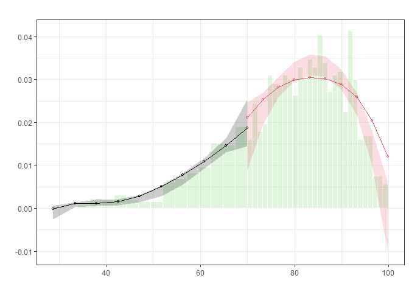

**Note**: Bias correction is only used for the construction of confidence intervals, but not for point estimation. So we see some points are out of the confidence intervals.

### Discontinuity in Outcome

So far, we have known this is a sharp design and that there's no manipulation on the entrance exam scores around the threshold–70. Now we can finally see if there's a discontinuity in the exit exam scores based on the participation in the tutoring program.

```r
ggplot(tutoring, aes(x = entrance_exam, y = exit_exam, color = tutoring)) +
  geom_point(size = 0.5, alpha = 0.5) +
  # Add a line based on a linear model for the people scoring 70 or less
  geom_smooth(data = filter(tutoring, entrance_exam <= 70), method = "loess", formula = 'y ~ x') +
  # Add a line based on a linear model for the people scoring more than 70
  geom_smooth(data = filter(tutoring, entrance_exam > 70), method = "loess", formula = 'y ~ x') +
  geom_vline(xintercept = 70) +
  labs(x = "Entrance exam score", y = "Exit exam score", color = "Used tutoring")
```

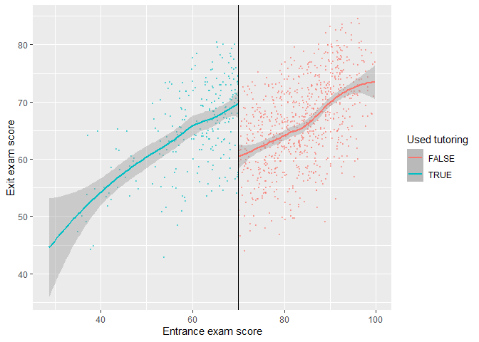

Based on this graph, there's a clear discontinuity, suggesting the participation in the tutoring program boosted the exit exam scores.

### Parametric Estimation (Regression)

- How big is this discontinuity?
- Is it statistically significant?

We can check the size in a parametric method (i.e. using `lm()` with specific parameters and coefficients). Particularly, We estimate in a linear regression specified as following,

$$
\text{Exit exam} = \beta_0 + \beta_1\text{Entrance exam score}_{\text{centered}} + 
\beta_2\text{Tutoring program} + \epsilon*.
$$

where $\text{Entrance exam score}_{\text{centered}}$ shows how many points away from the threshold $70$

- $\beta_0$: This is the intercept. Since we centered *entrance* exam scores, it shows the average *exit* exam score at the threshold. People who scored 70.001 points on the entrance exam had an average of 59.4 points on the exit exam.
- $\beta_1$: This represents the slope of the linear equation on both sides of the threshold.
- $\beta_2$: This is the coefficient of interest, suggesting the causal effect of participation in the tutoring program.

#### Robustness Check

1. We can include extra demographics and use a polynomial regression including $\text{entrance}_\text{centered}^2$, $\text{entrance}_\text{centered}^3$, or $\text{entrance}_\text{centered}^4$ to fit the data as close as possible.

2. We care most about the observations right around the threshold rather than observations far away from the center. Therefore, we should only include the students who had scores just barely under and over 70. Accordingly, We can fit the same model and restrict it to students within a smaller window, or bandwidth, like $70\pm10$, or $70\pm5$.

```r
tutoring[, entrance_centered := entrance_exam - 70]

model_simple <- lm(exit_exam ~ entrance_centered + tutoring,
                   data = tutoring)
# round(summary(model_simple)$coef, 4)

model_poly <- lm(exit_exam ~ entrance_centered + I((entrance_centered/10)^2) + 
                   I((entrance_centered/10)^3) + I((entrance_centered/10)^4) + 
                   tutoring, data = tutoring)
# round(summary(model_ploy)$coef, 4)

model_bw_10 <- lm(exit_exam ~ entrance_centered + tutoring,
                  data = filter(tutoring,
                                entrance_centered >= -10 &
                                  entrance_centered <= 10))
# round(summary(model_bw_10)$coef, 4)

model_bw_5 <- lm(exit_exam ~ entrance_centered + tutoring,
                 data = filter(tutoring,
                               entrance_centered >= -5 &
                                 entrance_centered <= 5))
# round(summary(model_bw_5)$coef, 4)

model_bw_5_poly <- lm(exit_exam ~ entrance_centered + I((entrance_centered/10)^2) +
                        I((entrance_centered/10)^3) + I((entrance_centered/10)^4) + 
                        tutoring,
                      data = filter(tutoring,
                                    entrance_centered >= -5 &
                                      entrance_centered <= 5))
# round(summary(model_bw_5_poly)$coef, 4)
```

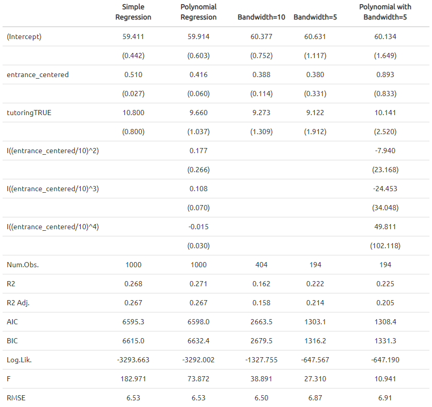

The effect of tutoring differs a lot across these different models, from 9.1 to 10.8. The comparison between RMSEs from `model_bw_5` and `model_bw_5_poly` might suggest the overfitting issue resulting from the over-specification with several polynomial terms and the small size of sample.

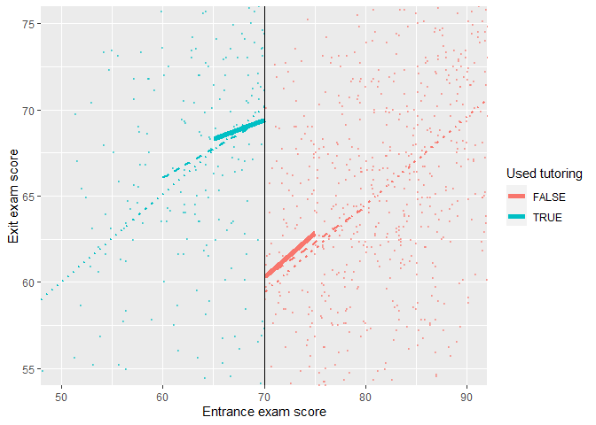

### Nonparametric Estimation (Kernel)

Instead of using linear regressions, we can use nonparametric methods (i.e. using kernel functions to determine the weights of observations and fit the data in non-linear function forms). The `rdrobust()` function makes it easy to estimate the causal effect at the cutoff with nonparametric methods.

```r
rdrobust(y = tutoring$exit_exam, x = tutoring$entrance_exam, c = 70) %>%
  summary()
```

    ## [1] "Mass points detected in the running variable."
    ## Call: rdrobust
    ## 
    ## Number of Obs.                 1000
    ## BW type                       mserd
    ## Kernel                   Triangular
    ## VCE method                       NN
    ## 
    ## Number of Obs.                  237          763
    ## Eff. Number of Obs.             144          256
    ## Order est. (p)                    1            1
    ## Order bias  (q)                   2            2
    ## BW est. (h)                   9.969        9.969
    ## BW bias (b)                  14.661       14.661
    ## rho (h/b)                     0.680        0.680
    ## Unique Obs.                     155          262
    ## 
    ## =============================================================================
    ##         Method     Coef. Std. Err.         z     P>|z|      [ 95% C.I. ]       
    ## =============================================================================
    ##   Conventional    -8.578     1.601    -5.359     0.000   [-11.715 , -5.441]    
    ##         Robust         -         -    -4.352     0.000   [-12.101 , -4.587]    
    ## =============================================================================

- The estimate of the causal effect is present in the table. It shows tutoring program causes an 8-point change in exit exam scores. Confidence intervals are constructed with normal Std. Err (conventional) and robust Std. Err (robust).
- The model used a bandwidth of 9.969 (`BW est. (h)` in the output), which means it includes students with test scores between \~60 and \~80.
- The model used a triangular kernel. The kernel decides how much weight to give to observations around the cutoff. The closer to the cutoff, the larger the weight. You can use different kernels and [this Wikipage](https://en.wikipedia.org/wiki/Kernel_(statistics)#Kernel_functions_in_common_use) has a nice summary.

```r
rdplot(y = tutoring$exit_exam, x = tutoring$entrance_exam, c = 70, nbins = 50,
       x.label = "Entrance exam score", y.label = "Exit exam score")
```

    ## [1] "Mass points detected in the running variable."

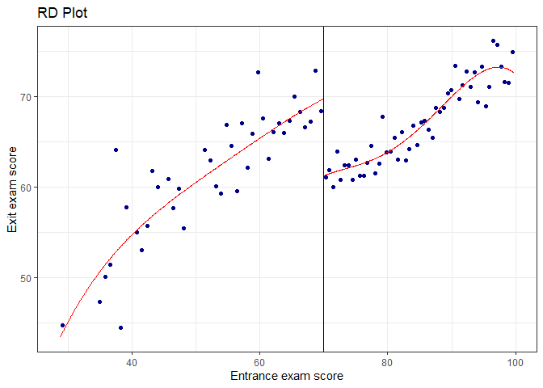

**Note**: Points in the graph are not the actual observations in the dataset. The `rdplot()` function makes bins of points (like a histogram) and then shows the average outcome within each bin. The argument `nbins` and `binselect` can be specified accordingly. Additionally, the plot part in the `rdplot()` output is a `ggplot()` object and hence inherit the associated features/functionalities.

#### Robustness Check

1. Try different Kernel functions
   
   > By default `rdrobust()` uses a triangular kernel (linearly decreasing weights). We can also use Epanechnikov (non-linearly decreasing weights) or uniform (equal weights, i.e., unweighted).

2. Try different the bandwidth algorithms

```r
rdbwselect(y = tutoring$exit_exam, x = tutoring$entrance_exam, c = 70, all = TRUE) %>%
  summary()
```

    ## [1] "Mass points detected in the running variable."
    ## Call: rdbwselect
    ## 
    ## Number of Obs.                 1000
    ## BW type                         All
    ## Kernel                   Triangular
    ## VCE method                       NN
    ## 
    ## Number of Obs.                  237          763
    ## Order est. (p)                    1            1
    ## Order bias  (q)                   2            2
    ## Unique Obs.                     155          262
    ## 
    ## =======================================================
    ##                   BW est. (h)    BW bias (b)
    ##             Left of c Right of c  Left of c Right of c
    ## =======================================================
    ##      mserd     9.969      9.969     14.661     14.661
    ##     msetwo    11.521     10.054     17.067     14.907
    ##     msesum    12.044     12.044     17.631     17.631
    ##   msecomb1     9.969      9.969     14.661     14.661
    ##   msecomb2    11.521     10.054     17.067     14.907
    ##      cerrd     7.058      7.058     14.661     14.661
    ##     certwo     8.156      7.118     17.067     14.907
    ##     cersum     8.526      8.526     17.631     17.631
    ##   cercomb1     7.058      7.058     14.661     14.661
    ##   cercomb2     8.156      7.118     17.067     14.907
    ## =======================================================

1. Compare the results using the ideal bandwidth, twice the ideal, and half the ideal

```r
# Ideal bandwidth 
rdbwselect(y = tutoring$exit_exam, x = tutoring$entrance_exam, c = 70) %>%
  summary()
```

    ## [1] "Mass points detected in the running variable."
    ## Call: rdbwselect
    ## 
    ## Number of Obs.                 1000
    ## BW type                       mserd
    ## Kernel                   Triangular
    ## VCE method                       NN
    ## 
    ## Number of Obs.                  237          763
    ## Order est. (p)                    1            1
    ## Order bias  (q)                   2            2
    ## Unique Obs.                     155          262
    ## 
    ## =======================================================
    ##                   BW est. (h)    BW bias (b)
    ##             Left of c Right of c  Left of c Right of c
    ## =======================================================
    ##      mserd     9.969      9.969     14.661     14.661
    ## =======================================================

```r
rdrobust(y = tutoring$exit_exam, x = tutoring$entrance_exam, c = 70, h = 9.969) %>%
  summary()
```

    ## [1] "Mass points detected in the running variable."
    ## Call: rdrobust
    ## 
    ## Number of Obs.                 1000
    ## BW type                      Manual
    ## Kernel                   Triangular
    ## VCE method                       NN
    ## 
    ## Number of Obs.                  237          763
    ## Eff. Number of Obs.             144          256
    ## Order est. (p)                    1            1
    ## Order bias  (q)                   2            2
    ## BW est. (h)                   9.969        9.969
    ## BW bias (b)                   9.969        9.969
    ## rho (h/b)                     1.000        1.000
    ## Unique Obs.                     155          262
    ## 
    ## =============================================================================
    ##         Method     Coef. Std. Err.         z     P>|z|      [ 95% C.I. ]       
    ## =============================================================================
    ##   Conventional    -8.578     1.601    -5.359     0.000   [-11.715 , -5.441]    
    ##         Robust         -         -    -3.276     0.001   [-12.483 , -3.138]    
    ## =============================================================================

```r
rdrobust(y = tutoring$exit_exam, x = tutoring$entrance_exam, c = 70, h = 9.969 * 2) %>%
  summary()
```

    ## [1] "Mass points detected in the running variable."
    ## Call: rdrobust
    ## 
    ## Number of Obs.                 1000
    ## BW type                      Manual
    ## Kernel                   Triangular
    ## VCE method                       NN
    ## 
    ## Number of Obs.                  237          763
    ## Eff. Number of Obs.             206          577
    ## Order est. (p)                    1            1
    ## Order bias  (q)                   2            2
    ## BW est. (h)                  19.938       19.938
    ## BW bias (b)                  19.938       19.938
    ## rho (h/b)                     1.000        1.000
    ## Unique Obs.                     155          262
    ## 
    ## =============================================================================
    ##         Method     Coef. Std. Err.         z     P>|z|      [ 95% C.I. ]       
    ## =============================================================================
    ##   Conventional    -9.151     1.130    -8.100     0.000   [-11.365 , -6.937]    
    ##         Robust         -         -    -4.980     0.000   [-11.670 , -5.078]    
    ## =============================================================================

```r
rdrobust(y = tutoring$exit_exam, x = tutoring$entrance_exam, c = 70, h = 9.969 / 2) %>%
  summary()
```

    ## [1] "Mass points detected in the running variable."
    ## Call: rdrobust
    ## 
    ## Number of Obs.                 1000
    ## BW type                      Manual
    ## Kernel                   Triangular
    ## VCE method                       NN
    ## 
    ## Number of Obs.                  237          763
    ## Eff. Number of Obs.              82          109
    ## Order est. (p)                    1            1
    ## Order bias  (q)                   2            2
    ## BW est. (h)                   4.984        4.984
    ## BW bias (b)                   4.984        4.984
    ## rho (h/b)                     1.000        1.000
    ## Unique Obs.                     155          262
    ## 
    ## =============================================================================
    ##         Method     Coef. Std. Err.         z     P>|z|      [ 95% C.I. ]       
    ## =============================================================================
    ##   Conventional    -8.201     2.348    -3.493     0.000   [-12.803 , -3.600]    
    ##         Robust         -         -    -2.032     0.042   [-13.618 , -0.246]    
    ## =============================================================================

## Practice 7: Regression Discontinuity - Fuzzy

In the sharp RD example in Practice 6, it was fairly easy to measure the size of the jump at the cutoff because compliance was perfect. No people who scored above the threshold used the tutoring program, and nobody who qualified for the program did not participate.

```r
tutoring_fuzzy <- fread("RD/tutoring_program_fuzzy.csv")
print(paste(c('Number of Rows:', 'Number of Columns:'), dim(tutoring_fuzzy)))
```

    ## [1] "Number of Rows: 1000" "Number of Columns: 5"

```r
# kbl(head(tutoring_fuzzy)) %>%
#   kable_paper() %>%
#   scroll_box(width = "100%") # height = "400px"
head(tutoring_fuzzy)
```

    ##    id entrance_exam tutoring tutoring_text exit_exam
    ## 1:  1      92.40833    FALSE      No tutor  78.07592
    ## 2:  2      72.77238    FALSE      No tutor  58.21757
    ## 3:  3      53.65090     TRUE         Tutor  61.96543
    ## 4:  4      98.32688    FALSE      No tutor  67.48956
    ## 5:  5      69.71219     TRUE         Tutor  54.12888
    ## 6:  6      68.06771     TRUE         Tutor  60.13143

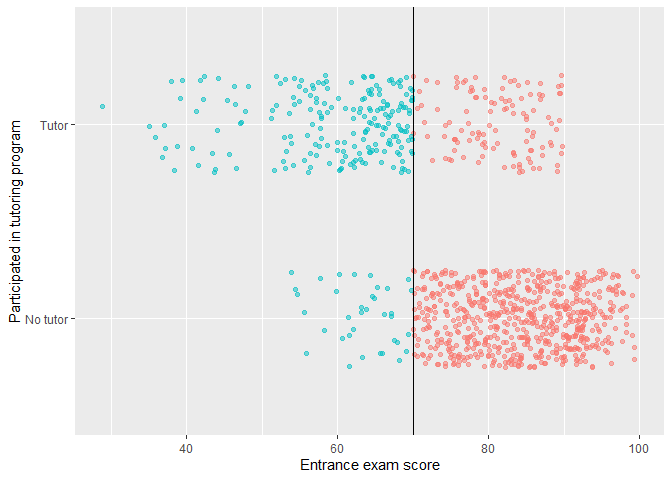

Check the count and percentages of compliance:

```r
tutoring_fuzzy[, leq70 := entrance_exam <= 70]
tutoring_fuzzy[, .(count = .N), by = c('tutoring', 'leq70')][
  , per := round(count/sum(count)*100, 2), by = 'leq70'][
    order(leq70, tutoring)]
```

    ##    tutoring leq70 count   per
    ## 1:    FALSE FALSE   646 84.78
    ## 2:     TRUE FALSE   116 15.22
    ## 3:    FALSE  TRUE    36 15.13
    ## 4:     TRUE  TRUE   202 84.87

This table shows there are 36 students who should participate didn't while 116 who shouldn't participate did. The students who shouldn't participate but did account for about one third of all enrolled students. This is a **fuzzy** design.

### Fuzzy Gap

First, let's look at a histogram that shows the probability of being in the tutoring program at different entrance exam scores.

```r
tutoring_fuzzy[, exam_bin := cut(entrance_exam, breaks = seq(0, 100, 5))]

tutoring_bins <- tutoring_fuzzy[, .(count = .N, count_t = sum(tutoring), 
                                    per = 100*sum(tutoring)/.N)
                                , by = 'exam_bin'][order(exam_bin)]

ggplot(data = tutoring_bins, aes(x = exam_bin, y = per)) + 
  geom_col() + geom_vline(xintercept = 8.5) +
  labs(x = "Entrance exam score", y = "Proportion of students participating in program")
```

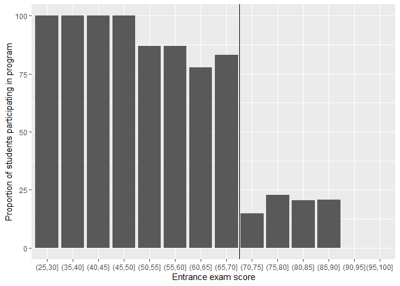

If this were a sharp design, every single bar to the left of the cut point would be 100% and every single bar to the right would be 0%, but that's not the case in this fuzzy design.

- 100% of students who scored between 25 and 50 on the entrance exam used tutoring
- This rate drops to 80ish% up until the cut point at 70
- There's about 15% chance of using tutoring if students are above the threshold

### Discontinuity in Outcome

We can visualize the gap by making scatter plots of running variable against outcome. Moreover, we can fit data with linear and local polynomial regressions on both sides of the threshold.

**Fit data with linear regressions**

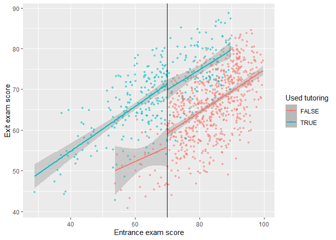

**Fit data with local polynomial regressions**

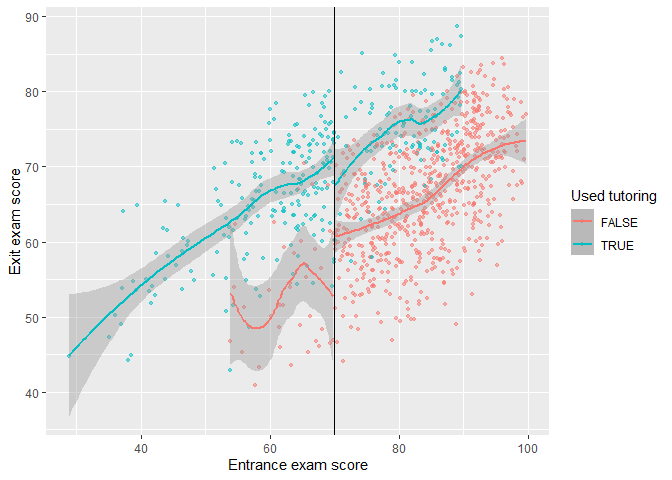

### Parametric and Non-parametric Estimation

Given the compliance issues, we need to isolate causal effects for compliers from others, i.e., the *complier average causal effect* (**CACE**).

As a result, we need an **instrument** which implies what should have happened rather than what actually happened. In a fuzzy design, the variable indicating if someone is above or below the threshold is a valid instrument.

Particularly, in this example, let "entrance score less than 70", "participation in tutoring", and "exit score" be denoted as $Z$, $X$, and $Y$. The indication variable of “entrance score less than 70” satisfies all requirements for a valid instrument:

- Relevance: The cutoff affects the access to the tutoring program; $Z \rightarrow X$ and $Cor(Z, X)\neq 0$.
- Exclusion: The cutoff affects exit exam scores only through the tutoring program; $Z \rightarrow X\rightarrow Y$ and $Cor(Z,Y|X)=0$.
- Exogeneity: Unobserved confounders between the tutoring program and exit exam scores are unrelated to the cutoff in local. For example, IQ is an unobserved variable in the outcome equation. The implicit assumption is that students who scored barely below or above the cutoff have the same level of IQ.

```r
tutoring_fuzzy[, entrance_centered := entrance_exam - 70]

# Run a regression in a sharp RD design
model_sharp <- lm(exit_exam ~ entrance_centered + tutoring,
                  data = filter(tutoring_fuzzy,
                                entrance_centered >= -10 &
                                  entrance_centered <= 10))

# Run a regression in a fuzzy RD design
model_fuzzy <- estimatr::iv_robust(exit_exam ~ entrance_centered + tutoring |
                                     entrance_centered + leq70,
                                   data = filter(tutoring_fuzzy,
                                                 entrance_centered >= -10 & 
                                                   entrance_centered <= 10))

modelsummary(list("Sharp RD (wrong)" = model_sharp,
                  "Fuzzy RD (bw = 10)" = model_fuzzy),
             gof_omit = "IC|Log|Adj|p\\.value|statistic|se_type|RMSE|Std.Errors",
             stars = TRUE, output = "table2.tex") 
```

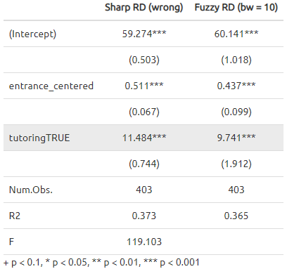

**Note**:

- We're estimating a **CACE** or a *local average treatment effect* (**LATE**) for people in the bandwidth, because we're working with regression discontinuity.
- We're estimating the CACE/LATE for compliers only, because we're using instruments.
- We **should check the robustness** of estimates by modifying the bandwidth, adding polynomial terms, and others that we discussed in Practice 6.

Also, we can estimate the CACE in non-parametric methods. We use the fuzzy argument in `rdrobust()` to specify the treatment column (or tutoring in our case). Importantly, we do not need to specify an instrument (or even create one!). All you need to specify is the column that indicates treatment status. `rdrobust()` will do all the above/below-the-cutoff instrument stuff automatically for us.

```r
rdrobust(y = tutoring_fuzzy$exit_exam, x = tutoring_fuzzy$entrance_exam,
         c = 70, fuzzy = tutoring_fuzzy$tutoring) %>%
  summary()
```

    ## Call: rdrobust
    ## 
    ## Number of Obs.                 1000
    ## BW type                       mserd
    ## Kernel                   Triangular
    ## VCE method                       NN
    ## 
    ## Number of Obs.                  238          762
    ## Eff. Number of Obs.             170          347
    ## Order est. (p)                    1            1
    ## Order bias  (q)                   2            2
    ## BW est. (h)                  12.985       12.985
    ## BW bias (b)                  19.733       19.733
    ## rho (h/b)                     0.658        0.658
    ## Unique Obs.                     238          762
    ## 
    ## =============================================================================
    ##         Method     Coef. Std. Err.         z     P>|z|      [ 95% C.I. ]       
    ## =============================================================================
    ##   Conventional     9.683     1.893     5.116     0.000     [5.973 , 13.393]    
    ##         Robust         -         -     4.258     0.000     [5.210 , 14.095]    
    ## =============================================================================

**Note**:

- We **should check the robustness** of estimates by modifying the bandwidth (ideal, half, double) and using different kernels (e.g., uniform, triangular, Epanechnikov).

**Recall**:

There is an alternative way to evaluate an causal effect with ONE instrument in regressions:

$$
\beta_{\text{IV}} = \frac{\beta_\text{reduced form}}{\beta_\text{1st stage}},
$$

where the first stage and the reduced form are specified respectively as

$$
\begin{align*}~
x_\text{endog} &= \beta_\text{1st stage}z+ X_\text{exog}'\theta+\eta, \text{ and}\\\\
y &= \beta_\text{reduced form}z+X_\text{exog}'\gamma+\epsilon.
\end{align*}
$$

```r
model_FirstStage <- lm(tutoring ~ entrance_centered + leq70, 
                       data = filter(tutoring_fuzzy, 
                                     entrance_centered >= -10 & 
                                       entrance_centered <= 10))

model_Reduced <- lm(exit_exam ~ entrance_centered + leq70, 
                    data = filter(tutoring_fuzzy, 
                                  entrance_centered >= -10 & 
                                    entrance_centered <= 10))

model_Reduced$coef['leq70TRUE']/model_FirstStage$coef['leq70TRUE']
```

    ## leq70TRUE 
    ##  9.741044
