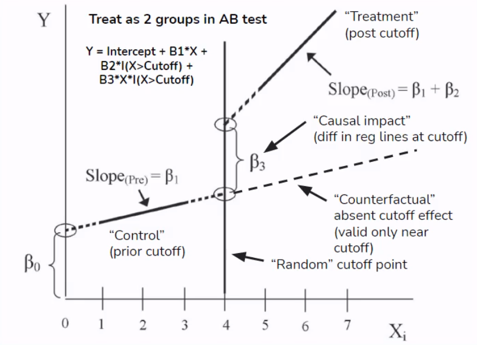
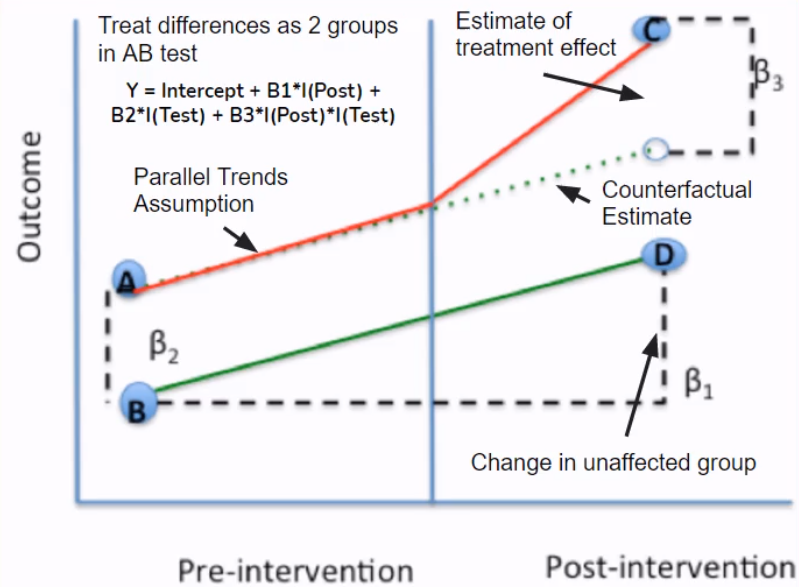

Running an AB test becomes a generic solution when we are interested in the causal impacts of a new feature on the product sales or performance. What if we cannot set up the environment of an experiment because of market regulation?

In this post, we turn back to some essential methods in causal inference. These methods are briefly covered by the Coursera Project, titled "[Essential Causal Inference Techniques for Data Science](https://www.coursera.org/projects/essential-causal-inference-for-data-science)."

## Idea behind Causal Inference

Try to control for all possible confounders and **look for "natural sources" of variation that can split our data into quasi random groups** and mimic the randomization we would get from an AB test.

In other words, removing the effects of all the potential confounders, we believe that testing groups are randomly split and comparable.

## Essential Methods

### Controlled Regression

+ We have Y => usage as measured by completing the 2nd week of a course
+ and X => First Week NPS (net promoter score) which is a satisfaction rating on a 1-10 scale

+ Univariate regression of Y (usage) on X (product quality)

+ Multiple regression of Y (usage) on X (product quality) and a set of controls

If 

1. the R squared in the multiple regression increases "a lot" from that in the univariate regression

2. coefficient on X is similar in the two models

then by the theory of controlled regression, we can use it as the causal impact.

> Sources of Error
>
> + Omitted Variable Bias
>
>   Look at the R squared in the multiple regression with controls and how large it is (if R^2^ is not close to 100% we know there are a lot of omitted variables in our regression)
>
> + Included Variable Bias
>
>   This is the opposite of omitted variable bias and involves the inclusion of too many controls. No direct way to identify this problem but generally can leave out controls that are not determined at time observe X. In the ML context, it is the information leakage (e.g., target encoding), that is, using future to predict the past.

Controlled regression can be a bit of art form and a bit of random. People nowadays prefer the other causal inference techniques that are considered to be more rigorous and reliable.

### Regression Discontinuity

Focus on cut-off point that can be thought of as local randomized experiment.

> Arbitrarily assigned cutoff point randomly splits the sample into two comparable groups around the cutoff point. 

+ Y: Revenue or course enrollment

+ X: Advertisement (advertised, e.g., via email, if the percentage of subtitled materials in a course is greater than 80%)

+ Assumption

  1. Courses below and above the 80% subtitle threshold are similar to one another, so the discontinuity point effectively randomizes the sample.

     > Check:
     >
     > 1. Sample size similar below and above cutoff (i.e., roughly balanced)
     > 2. Sample below and above cutoff are similar on observable/confounders

  2. Advertising available or not is assumed to be the only differentiator between courses at the 70% subtitle value and the 90% subtitle value.

     > Check:
     >
     > Conduct placebo tests, that is, run regression discontinuity at points other than the cutoff and check for no effect (e.g., run regression discontinuity at 20%, 30%, and 40% and we shouldn't find any significant difference at these levels)

Using regression discontinuity design (RDD), we estimate a linear regression with a term of the X variable with the discontinuity, an indicator for the discontinuity (which is a function of the X variable being above or below the cutoff point), and the interaction of the X variable and the discontinuity indicator.
$$
y=\beta_0+\beta_1 \cdot x+\beta_2 \cdot I(x\ge c)+\beta_3\cdot x \cdot I(x\ge c),
$$
where $x$ is the variable with the discontinuity, $I(\cdot)$ is an indicator function, and $c$ is the randomly assigned cutoff point.

> Note this regression fits two linear models (with different coefficients) below and above the cutoff point. When $x<c$, the intercept and the coefficient of the X variable are $\beta_0$ and $\beta_1$. In contrast, when $x\ge c$, the intercept and the coefficient become $\beta_0+\beta_2$ and $\beta_1+\beta_3$.
>
> This change in the model structure is analog to the formulation of the Chow test for examining the structural break.

Comparing pre and post the discontinuity, we obtain the causal effect given by
$$
\beta_2 + \beta_3\times c.
$$

### Difference-in-Difference

+ Y: Revenue

+ X: Price change

+ Assumption: Parallel Trends

  Check revenue in control country with no price change was similar and highly correlated with revenue in treatment country with price change (ensure control can serve as counterfactual)

  1. Graph control and treatment groups in the pre period and see if highly correlated
  2. Build a regression model to check whether trends are identical (hypotheses testing if there is no difference in slopes between two groups)

+ Extension: **Synthetic Control**

  + Problem with regular DID: Picking a single control group that satisfies parallel trends can be arbitrary
  + Synthetic control creates a synthetic control group that is a weighted average of many control groups
    1. Choose weights to minimize tracking error with treatment group pre intervention (parallel trends)
    2. Causal estimate is difference post intervention between treatment and "synthetic control" 
  + R packages: [`Synth`](https://cran.r-project.org/web/packages/Synth/index.html); [`CausalImpact`](https://cran.r-project.org/web/packages/CausalImpact/) (Bayesian Version)

### Instrumental Variables

+ Assumptions

  1. Strong First Stage: Instruments are strong predictors for the X variable

     Hypothesis tests for weak instruments

  2. Exclusion Restriction: Instruments have an impact on the Y variable only through their impact on the X variable

     There is no test for this assumption. We need to use logic to strengthen the validity of this assumption. In a **randomized encouragement trial** (i.e., a RCT used for product promotion campaign; think of email notification) where we create the instrument as a randomly assigned nudge that prompts the X variable, we can ensure exclusion restriction through random assignment.

### Machine Learning (ML) + Causal Inference

+ Weakness of classic causal approaches

  + Fail with many covariates
  + Model selection unprincipled
  + Linear relationships and no interactions

+ Benefits of ML

  + Handle high dimensionality
  + Principled ways to choose model
  + Nonlinear model using higher order features

+ ML form controlled regression

  + Use ML models to control for many potential confounders and/or nonlinear effects. 

    >Standard controlled regression steps
    >
    >+ Regress Y on X and a set of controls C to identify coefficient of interest on X
    >+ Be wary of omitted and included variable biases

  + There are two types of ML form controlled regressions:

    + Double Selection (LASSO)
    + Double Debiased (Generic ML models)

    > Double Selection on AB test data:
    >
    > + Reduce the noises and increase statistical power (give smaller confidence intervals in a shorter experiment period)
    > + Good for small samples and small effect sizes (i.e., small expected difference between A and B groups)

  + Steps

    + Define outcome Y, treatment indicator X, and high dimensional set of controls C

    + Split data into two sets: Training and Testing (this can be generalized to k-folds)

    + **Fit** two Lassos of X\~C and Y\~C **on the training** data set

      > Use [the one standard error rule](https://stats.stackexchange.com/questions/138569/why-is-lambda-within-one-standard-error-from-the-minimum-is-a-recommended-valu) to choose the optimal $\lambda$ (i.e., the shrinkage parameter) for the LASSO regression
      >
      > The final set of controls is a union of controls from the LASSO regression X\~C and Y\~C

    + Take fitted models and **apply to the testing** data set

    + Get all nonzero variables in C and use as controls in controlled regression of Y on X

+ Causal Trees/Forests

  + Previous models assume homogeneous treatment effects. However, **causal trees/forests estimates heterogeneous treatment effects** where impact differs on observed criteria
    + Use trees (or forests) to identify partition of the demographic space that maximizes observed difference of Y between treatment and control while balancing overfitting

  + Steps
    + Split data into two halves
    + Fit trees/forests on one half (i.e., the splitting subsample) and apply to second half (i.e., the estimating subsample) to estimate treatment effects
    + Heterogeneous treatment effects from difference in Y in leaf nodes (i.e., the treatment effect conditioned on C attributes in leaf nodes) 
    + Optimization criteria set up to find the best fit given the splitting subsample
    + Forest is an average of a collection of trees with sampling
