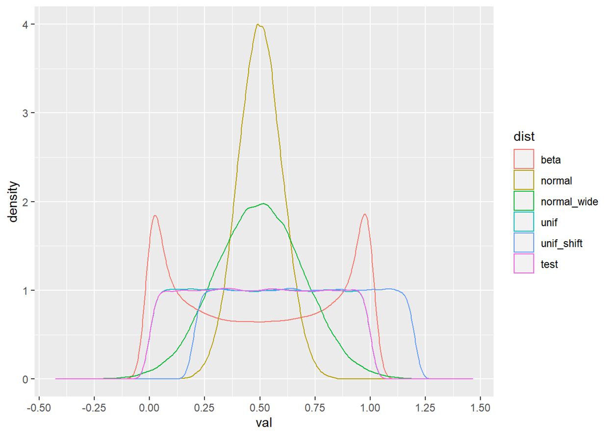
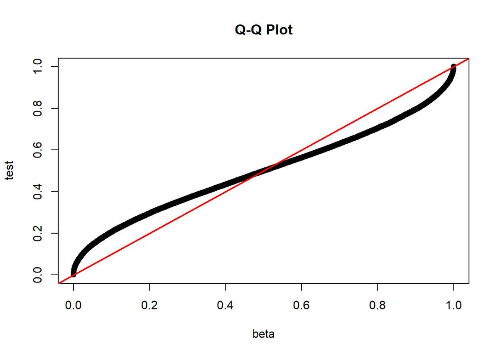
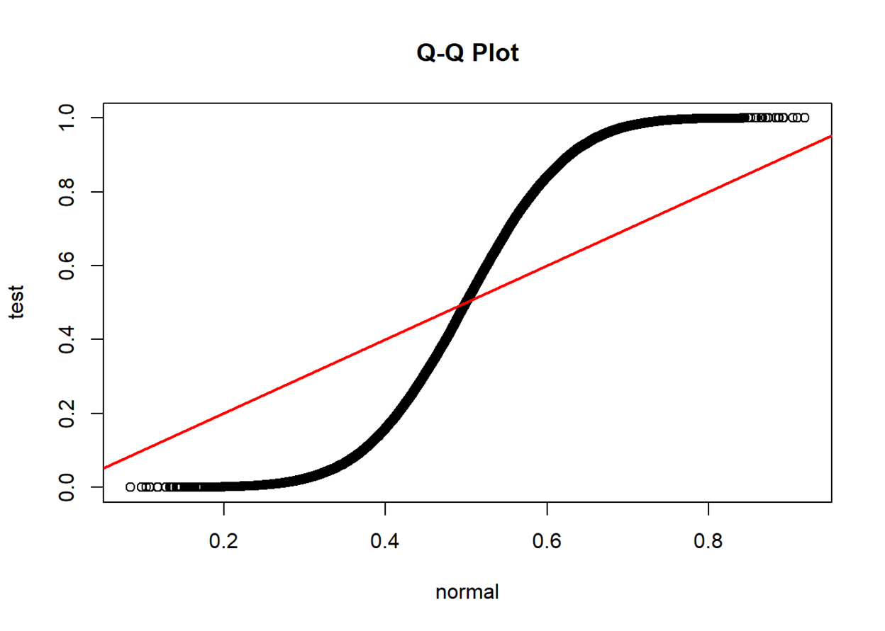
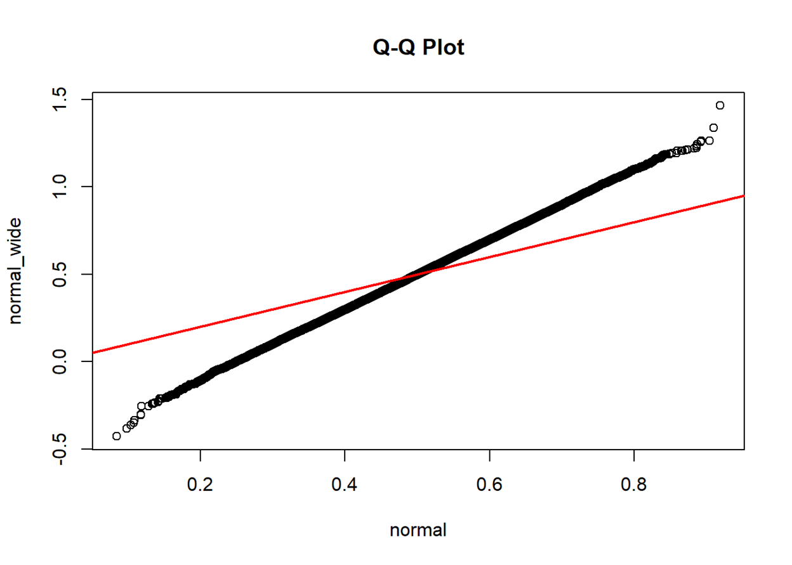
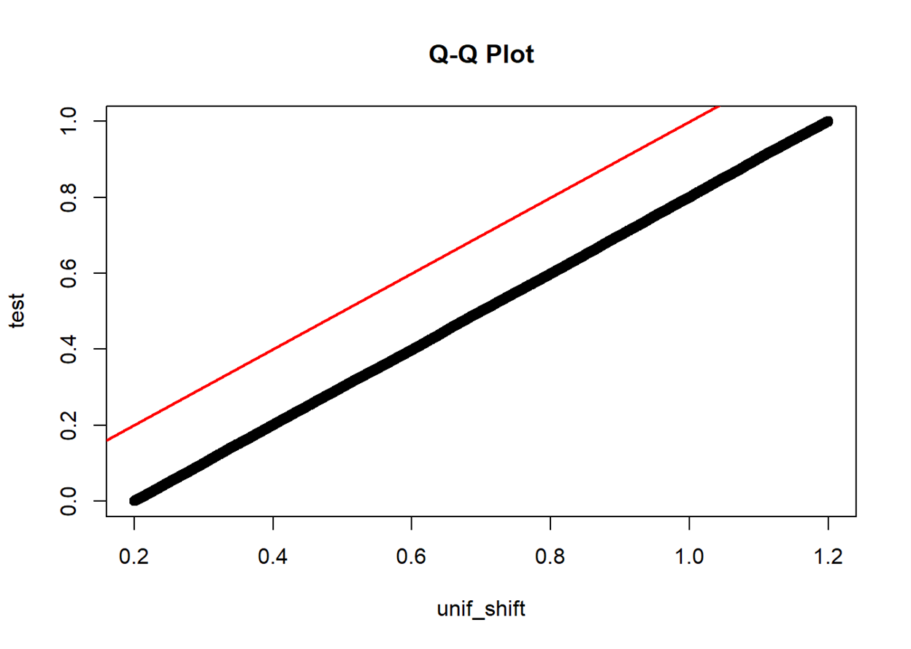
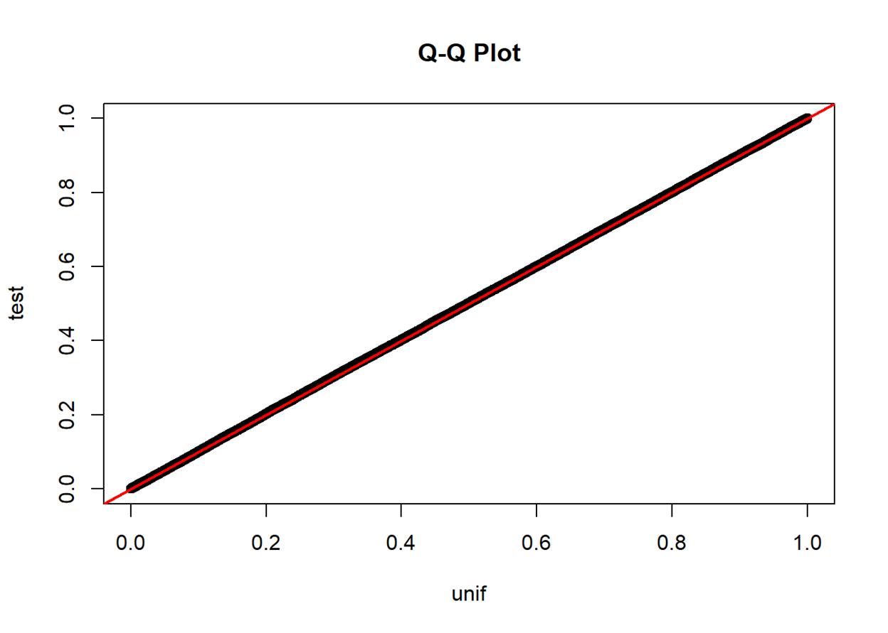
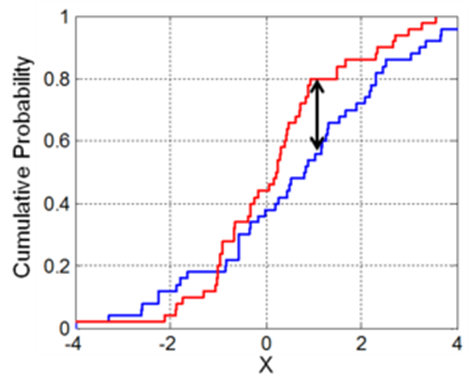

How to detect a distribution for a set of data points? When it comes to this question, we don't spend a second creating a histogram or a density plot to visualize the distribution of the given data points. If there are some potential distributions to be compared, we can add their PDF curves to the existing plot or create a QQ plot. That is it. We then move forward.

I didn't think of this question carefully until I failed an interview. Unfortunately, after saying we could detect the distribution by visualizing a density plot, I was expected to propose a test statistic. I vaguely remembered the rationale of the Kolmogorov-Smirnov (KS) Test but forgot the name. Although I found the KS statistic after the interview, I was still wondering if there was another simple test. My Eureka moment appeared when I watched a YouTube video about the Chi-squared Test. Yes, we can also compare the distributions from two sets of data points using the Chi-squared Test.

## Data Simulation

```r
# Load packages
library(data.table) # data manipulation
library(ggplot2)    # data visualization

set.seed(20221119)
n <- 100000
df <- data.table('id' = 1:n,
                 'beta' = rbeta(n, shape1 = 0.5, shape2 = 0.5),
                 'normal' = rnorm(n, mean = 0.5, sd = 0.05),
                 'normal_wide' = rnorm(n, mean = 0.5, sd = 0.1),
                 'unif' = runif(n, min = 0, max = 1),
                 'unif_shift' = runif(n, min = 0.2, max = 1.2),
                 'test' = runif(n, min = 0, max = 1))
df <- melt(df, id.vars = 'id', 
           measure.vars = c('beta', 'normal', 'normal_wide',
                            'unif', 'unif_shift', 'test'),
           variable.name = 'dist', value.name = 'val')
df[, quant:=as.numeric(cut(val, breaks=50)), by='dist']

ggplot(data = df, aes(x = val, color = dist)) +
  geom_density() + scale_x_continuous(n.breaks=10)
```



## Q-Q Plot

"In statistics, a **Q–Q plot** (**quantile-quantile plot**) is a probability plot, a [graphical method](https://en.wikipedia.org/wiki/List_of_graphical_methods "List of graphical methods") for comparing two probability distributions by plotting their *quantiles* against each other. A point (*x*, *y*) on the plot corresponds to one of the quantiles of the second distribution (*y*-coordinate) plotted against the same quantile of the first distribution (*x*-coordinate)." -- [Wikipedia](https://en.wikipedia.org/wiki/Q%E2%80%93Q_plot)

```r
qqplot(df[dist=='beta']$val, df[dist=='test']$val, 
       xlab = "beta", ylab = "test", main = "Q-Q Plot")
abline(a=0, b=1, col='red', lwd=2)
```



```r
qqplot(df[dist=='normal']$val, df[dist=='test']$val, 
       xlab = "normal", ylab = "test", main = "Q-Q Plot")
abline(a=0, b=1, col='red', lwd=2)
```



```r
qqplot(df[dist=='normal']$val, df[dist=='normal_wide']$val, 
       xlab = "normal", ylab = "normal_wide", main = "Q-Q Plot")
abline(a=0, b=1, col='red', lwd=2)
```



```r
qqplot(df[dist=='unif_shift']$val, df[dist=='test']$val, 
       xlab = "unif_shift", ylab = "test", main = "Q-Q Plot")
abline(a=0, b=1, col='red', lwd=2)
```



```r
qqplot(df[dist=='unif']$val, df[dist=='test']$val, 
       xlab = "unif", ylab = "test", main = "Q-Q Plot")
abline(a=0, b=1, col='red', lwd=2)
```



+ If two distributions are similar, the points in the Q–Q plot will approximately lie on the identity line $y=x$

+ If two distributions are similar, the points in the Q–Q plot will approximately lie on a line, parallel to the identity line

+ A Q-Q plot also sheds light on the shift of location parameters (e.g., how the median point in the test set locates in the point set from a known distribution) and the change in scale parameters (e.g., how the standard deviation of the test set differs from that of the standard normal)

## Kolmogorov–Smirnov Test

"In statistics, the **Kolmogorov–Smirnov test** (**K–S test** or **KS test**) is a [nonparametric test](https://en.wikipedia.org/wiki/Nonparametric_statistics) of the equality of continuous, *one-dimensional* probability distributions that can be used to compare a sample with a reference probability distribution (one-sample K–S test) or to compare two samples (two-sample K–S test)." -- [Wikipedia](https://en.wikipedia.org/wiki/Kolmogorov%E2%80%93Smirnov_test)

The Kolmogorov–Smirnov test may also be used to test whether two underlying one-dimensional probability distributions differ.

$$
D_{n,m}=\sup_x\left|F_{1,n}(x) - F_{2,m}(x)\right|
$$

where $F_{1,n}$ and $F_{2,m}$ are the empirical distribution functions of the first and the second sample respectively.



> Illustration of the two-sample Kolmogorov–Smirnov statistic. Red and blue lines each correspond to an empirical distribution function, and the black arrow is the two-sample KS statistic.

For large samples, the null hypothesis is rejected at level $\alpha$ if

$$
D_{n,m}>c(\alpha)\sqrt{\frac{n+m}{n\cdot m}},
$$

where $n$ and $m$ are the sizes of the first and the second sample respectively. The value of $c(\alpha)$ is given in the table below:

| $\alpha$    | 0.20  | 0.10  | 0.05  | 0.025 | 0.01  | 0.005 |
|:----------- |:-----:|:-----:|:-----:|:-----:|:-----:|:-----:|
| $c(\alpha)$ | 1.073 | 1.224 | 1.358 | 1.48  | 1.628 | 1.731 |

and in general

$$
c(\alpha)=\sqrt{-\ln\left(\frac{\alpha}{2}\right)\times\frac{1}{2}}.
$$

```r
ks.test(df[dist=='normal']$val, df[dist=='normal_wide']$val)
```

```
##  Two-sample Kolmogorov-Smirnov test
## 
## data:  df[dist == "normal"]$val and df[dist == "normal_wide"]$val
## D = 0.16634, p-value < 2.2e-16
## alternative hypothesis: two-sided
```

```r
ks.test(df[dist=='beta']$val, df[dist=='test']$val)
```

```
##  Two-sample Kolmogorov-Smirnov test
## 
## data:  df[dist == "beta"]$val and df[dist == "test"]$val
## D = 0.10644, p-value < 2.2e-16
## alternative hypothesis: two-sided
```

```r
ks.test(df[dist=='unif_shift']$val, df[dist=='test']$val)
```

```
##  Two-sample Kolmogorov-Smirnov test
## 
## data:  df[dist == "unif_shift"]$val and df[dist == "test"]$val
## D = 0.20304, p-value < 2.2e-16
## alternative hypothesis: two-sided
```

```r
ks.test(df[dist=='unif']$val, df[dist=='test']$val)
```

```
##  Two-sample Kolmogorov-Smirnov test
## 
## data:  df[dist == "unif"]$val and df[dist == "test"]$val
## D = 0.00356, p-value = 0.5506
## alternative hypothesis: two-sided
```

## Chi-squared Test

Suppose there are $n$ observations, classified into $k$ mutually exclusive groups with a respective number $x_i$ (for $i=1,2,\dots,k$) of observations in the $i$th group. In the null hypothesis, we assume an observation falls into the $i$th group with a probability of $p_i$, such that

$$
\sum_{i=1}^{k}p_i=1 \text{ and } 
\sum_{i=1}^k m_i=\sum_{i=1}^k (n\times p_i)= n.
$$

As $n\rightarrow\infty$, the limiting distribution of the quantity given below is the $\chi^2$ distribution with $k-1$ degrees of freedom:

$$
X^2=\sum_{i=1}^k\frac{(x_i-m_i)^2}{m_i}=\sum_{i=1}^k\frac{x_i^2}{m_i}-n
$$

```r
df_test <- dcast(df, quant ~ dist, value.var = 'val', fun.aggregate = length)
head(df_test)
```

```
##    quant beta normal normal_wide unif unif_shift test
## 1:     1 9001      2           1 1963       1918 1987
## 2:     2 3884      4           2 1931       1984 1955
## 3:     3 2891      5           2 2041       1993 2019
## 4:     4 2459      9           2 1991       1995 2009
## 5:     5 2213     21           6 2001       1965 1941
## 6:     6 2028     29          13 2065       2049 1985
```

```r
df_cut <- df[, .(cut_min = min(val)), by=c('dist', 'quant')][order(dist, quant)]
quant_min <- min(df_cut$quant)
df_cut[quant==quant_min, cut_min := ifelse(grepl('normal', dist),  -999, 
                                           ifelse(grepl('unif_shift', dist), 0.2, 0))]
df_cut[, .N, by='dist']
```

```
##           dist  N
## 1:        beta 50
## 2:      normal 50
## 3: normal_wide 47
## 4:        unif 50
## 5:  unif_shift 50
## 6:        test 50
```

> Simulated data points become sparse as moving to the two sides of the "normal_wide" distribution. Thus, when using `cut()`, some intervals are empty.

```r
for (dist_i in c('beta', 'normal', 'unif_shift', 'unif')) {
  cat('# ----', dist_i, 'v.s. test ----')
  test_group <- sapply(df_cut[dist==dist_i]$cut_min, function(x) df[dist=='test']$val>x)
  df_test <- data.table('quant'=rowSums(test_group), 'test'=df[dist=='test']$val)[
    , .(test=.N), by='quant'][order(quant)]
  data_test <- merge(df_count[, c('quant', dist_i), with=FALSE], df_test, by='quant', all.x = TRUE)
  setnafill(data_test, fill = 0)
  print(chisq.test(data_test[, -1]))
}
```

```
## # ---- beta v.s. test ----
##  Pearson's Chi-squared test
## 
## data:  data_test[, -1]
## X-squared = 14497, df = 49, p-value < 2.2e-16
## 
## # ---- normal v.s. test ----
##  Pearson's Chi-squared test
## 
## data:  data_test[, -1]
## X-squared = 79504, df = 49, p-value < 2.2e-16
## 
## # ---- unif_shift v.s. test ----
##  Pearson's Chi-squared test
## 
## data:  data_test[, -1]
## X-squared = 18099, df = 49, p-value < 2.2e-16
## 
## # ---- unif v.s. test ----
##  Pearson's Chi-squared test
## 
## data:  data_test[, -1]
## X-squared = 35.413, df = 49, p-value = 0.9273
```

```r
for (dist_i in c('normal')) {
  cat('# ----', dist_i, 'v.s. normal_wide ----')
  # test_group: length of val by number of cuts
  # Create a list of booleans for each value in the test sequence
  test_group <- sapply(df_cut[dist==dist_i]$cut_min, function(x) df[dist=='normal_wide']$val>x)
  # df_test: length of val by two =(aggregate by quant)=> number of cuts by two
  # Identify the cutoff group for each value and 
  # Count the number of values in each cutoff group
  df_test <- data.table('quant'=rowSums(test_group), 'normal_wide'=df[dist=='normal_wide']$val)[
    , .(normal_wide=.N), by='quant'][order(quant)]
  # data_test: number of cuts by three (i.e., quant, dist_target, dist_test)
  # Combine target and test sequence by cutoff groups
  data_test <- merge(df_count[, c('quant', dist_i), with=FALSE], df_test, by='quant', all.x = TRUE)
  setnafill(data_test, fill = 0)
  # Execute Chi-squared test
  print(chisq.test(data_test[, -1]))
}
```

```
## # ---- normal v.s. normal_wide ----
##  Pearson's Chi-squared test
## 
## data:  data_test[, -1]
## X-squared = 32200, df = 49, p-value < 2.2e-16
```
