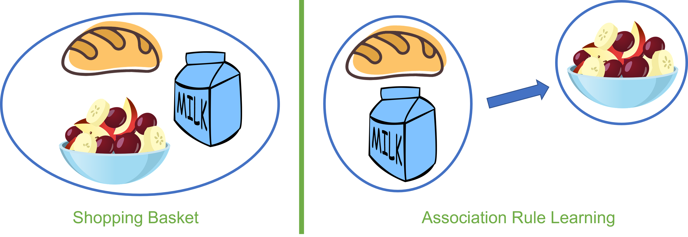

"Association rule learning is a rule-based machine learning method for discovering interesting relations between variables in large databases. ... In any given transaction with a variety of items, association rules are meant to discover the rules that determine how or why certain items are connected." -- [Wikipedia](https://en.wikipedia.org/wiki/Association_rule_learning)

This post briefly covers the following metrics:

- **Support** is the evidence of how frequently an item appears in the data given

- **Confidence** is defined by how many times the if-then statements are found true

- **Lift** is used to compare the expected Confidence (assume X and Y are independent) and the actual Confidence (think of the lift formula and divide $\text{supp}(X)$ for both the numerator and denominator)

## Support

The support of $X$ with respect to $T$ is defined as the proportion of transactions in the dataset which contains the itemset (or item) $X$:

$$
\text{Support of $X$}=\frac{\{(i,t)\in T:X\subseteq t\}}{|T|}
$$

where $i$ is the transaction ID and $t$ is its full itemset. 

Example, the support of $\{A,B\}$:

$$
\text{Support}=P(A\cap B)=\frac{\text{number of trans containing $A$ and $B$}}
{\text{total number of trans}}
$$

## Confidence

With respect to $T$, the confidence value of an association rule, often denoted as $X\Rightarrow Y$, is the ratio of transactions containing both $X$ and $Y$ to the total amount of $X$ values present, where $X$ is the antecedent and $Y$ is the consequent.

Confidence can also be interpreted as an estimate of the conditional probability $P(E_Y\mid E_X)$.

$$
\begin{align*}
\text{conf}(X\Rightarrow Y)=& P(Y\mid X)=\frac{\text{supp}(X\cap Y)}{\text{supp}(X)}
\\=&\frac{\text{number of trans containing $X$ and $Y$}}{\text{number of trans containing } X}
\end{align*}
$$

### Example

**Data** (5 Transactions and 5 Items)

| Transaction ID | milk | bread | butter | egg | fruit |
| -------------- | ---- | ----- | ------ | --- | ----- |
| 1              | 1    | 1     | 0      | 0   | 1     |
| 2              | 0    | 0     | 1      | 1   | 1     |
| 3              | 0    | 0     | 0      | 0   | 0     |
| 4              | 1    | 1     | 1      | 1   | 1     |
| 5              | 0    | 1     | 0      | 0   | 0     |

**Support and Confidence**

| if Antecedent then Consequent         | supp      | conf       | supp X conf           |
| ------------------------------------- | --------- | ---------- | --------------------- |
| if buy milk, then buy bread           | $2/5=0.4$ | $2/2=1.0$  | $0.4\times1.0=0.4$    |
| if buy milk, then buy eggs            | $1/5=0.2$ | $1/2=0.5$  | $0.2\times0.5=0.1$    |
| if buy bread, then buy fruit          | $2/5=0.4$ | $2/3=0.66$ | $0.4\times0.66=0.264$ |
| if buy fruit, then buy eggs           | $2/5=0.4$ | $2/3=0.66$ | $0.4\times0.66=0.264$ |
| if buy milk and bread, then buy fruit | $2/5=0.4$ | $2/2= 1.0$ | $0.4\times1.0=0.4$    |

+ Itemset $\{\text{milk,bread}\}$ has a support of 0.4 since it occurs in 40% of all transactions.

+ The rule $\{\text{milk,bread}\}\Rightarrow\{\text{butter}\}$ has a confidence value of $\frac{1/5}{2/5}=0.5$, suggesting butter is bought 50% of the times when milk and bread are bought.

## Lift

The ratio of the observed support to that expected if $X$ and $Y$ were independent:

$$
\text{lift}(X\Rightarrow Y)=\frac{\text{supp}(X\cap Y)}{\text{supp}(X)\times\text{supp}(Y)}
$$

For example, the rule $\{\text{milk,bread}\}\Rightarrow\{\text{butter}\}$ has a lift of $\frac{0.2}{0.4\times 0.4}=1.25$

|                 | Implied Relation                                                       |
| --------------- | ---------------------------------------------------------------------- |
| $\text{lift}=1$ | Independent                                                            |
| $\text{lift}>1$ | The degree to which those two occurrences are dependent on one another |
| $\text{lift}<1$ | The degree to which the items are substitute to each other             |

## Summary

+ If the rules were built from analyzing all the possible itemsets from the data then there would be so many rules that they wouldn't have any meaning. That is why Association rules are typically made from rules that are well-represented by the data
  
  + When using Association rules, you are most likely to only use Support and Confidence. However, this means you have to satisfy a *user-specified minimum support* and a *user-specified minimum confidence* at the same time.

+ **Benefit**
  
  Find the pattern that helps understand the correlations and co-occurrences between data sets. A very good real-world example that uses Association rules would be medicine. Medicine uses Association rules to help diagnose patients. [symptoms => illness]

+ **Downfalls**
  
  + Find the appropriate parameter and threshold settings for the mining algorithm
  
  + Have a large number of discovered rules, for which the algorithm does not guarantee the relevancy/reliability

## R Package and Tutorial

[CRAN - Package arules](https://cran.r-project.org/web/packages/arules/index.html)

[arules: Association Rule Mining with R - A Tutorial (PDF File)](https://michael.hahsler.net/research/arules_RUG_2015/talk/arules_RUG2015.pdf)
