### Causal Graphs

+ Directed Graph (A affects Y)
  
  + A and Y are known as nodes or vertices (variables)
  
  + The link (edge) between A and Y is an arrow, which means there is a direction (directed path)
  
  + Variables connected by an edge are adjacent
  
  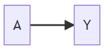

+ Undirected Graph (Association between A and Y)
  
  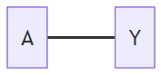

+ Directed Acyclic Graph (DAG)
  
  + No undirected paths
  - No cycles
  
  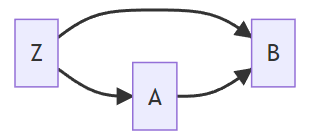

+ Terminology
  
  + A is Z's **parent**
  - B is a **child** of Z
  
  - D is a **decendant** of A
  
  - Z is an **ancestor** of D
  
  - D has two **parents**, B and Z
  
  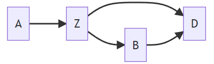
  
  We use DAGs to help us determine the set of variables that we need to control in order to achieve ignorability.

### Relationship with Probability Distributions

DAGs encode assumptions about dependencies between nodes.

##### Example 1

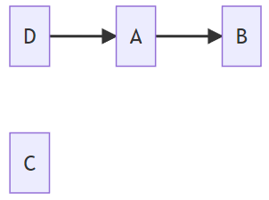

- $\Pr(C\mid A,B,D)=\Pr(C)$ i.e., C is independent of all variables

- $\Pr(B\mid A,C,D)=\Pr(B\mid A)$ i.e.,$ B\perp D$, $C \mid A$

- $\Pr(B\mid D)\neq\Pr(B)$, because B and D are marginally dependent

- $\Pr(D\mid A, B, C)=\Pr(D\mid A)$

##### Example 2

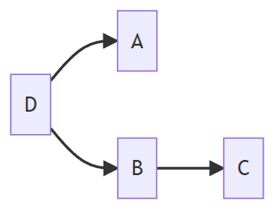

+ $\Pr(A\mid B,C, D)=\Pr(A\mid D)$ i.e., $A\perp B,C\mid D$
+ $\Pr(D\mid A, B,C)=\Pr(D\mid A,B)$ i.e., $D\perp C\mid B$

##### Example 3

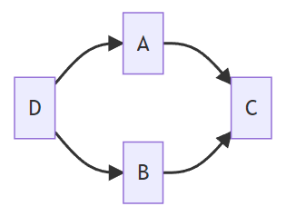

+ $\Pr(A\mid B,C, D)=\Pr(A\mid C,D)$ i.e., $A \perp B \mid C, D$
+ $\Pr(D\mid A, B,C)=\Pr(D\mid A,B)$ i.e., $D\perp C\mid A, B$

#### Decomposition of Joint Distribution

We can decompose the join distribution by sequential conditioning only on sets of parents.

+ Start with roots (nodes with no parents)

+ Proceed down the descendant line, always conditional on parents

##### Example 1

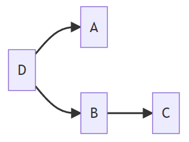

+ One root, D; two children of D, A and B
+ $\Pr(A,B,C,D)=\Pr(D)\Pr(A\mid D)\Pr(B\mid D)\Pr(C\mid B)$

##### Example 2

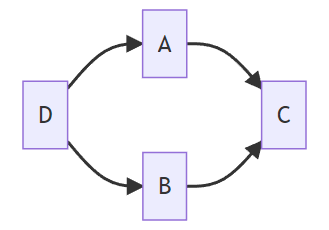

+ $\Pr(A,B,C,D)=\Pr(D)\Pr(A\mid D)\Pr(B\mid D)\Pr(C\mid A, B)$

### Paths and Associations

#### Type of Paths

+ Fork
  
  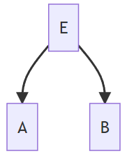

+ Chain
  
  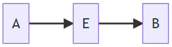

+ Inverted Fork
  
  + E is a **collider**
  
  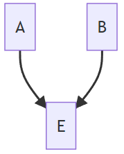

### Conditional Independence (d-separation)

d-separation: "d" stands for dependence.

#### Blocking

+ Paths and associations can be *blocked* by conditioning on nodes in the path.

+ However, the opposite situation occurs in inverted paths if a collider is conditioned on.

#### Rules of d-separation

A path is d-separated by a set of nodes C if:

+ It contains a chain (e.g., $D\rightarrow E\rightarrow F$) and the middle part is in C (i.e., $E$)
  
  > [Example] D is temperature, E is sidewalks are icy, and F is someone falls. If we restrict to situation where sidewalks are icy (condition on G), then temperature and falling are not associated via this path.

+ It contains a fork (e.g., $D\leftarrow E \rightarrow F$) and the middle part is in C (i.e., $E$)
  
  > In this path, D and F are dependent because of E. If E is given or fixed, E no longer affects D and F. Hence, they are independent (i.e., the path is blocked). 

+ It contains an inverted fork (e.g., $D\rightarrow E\leftarrow F$) and the middle part is NOT in C, nor are any descendants of it. In other words, no need to control anything in this path where $E$ is collider and the relation between $D$ and $F$ is independent.
  
  > [Example] $D$ is the state of an ON/OFF switch, while $F$ is the state of another switch. Both switches control the same light. We decide the state of $D$ and $F$ by flipping a fair coin, respectively. $E$ is the event that the light is ON, where the light is ON if only if both switches are ON.
  > 
  > Hence, $D$ and $F$ are independent if the information on $E$ is not known. In contrast, $D$ and $F$ are dependent if $E$ is given/controlled.

### Confounding Revisited

#### Confounders

A confounder is a variable that affects both the treatment and the outcome.

##### Example

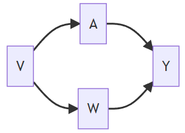

+ V affects A directly and Y indirectly through W

+ V is a confounder in the relation between A and Y

#### Frontdoor Paths

A frontdoor path from A to Y is one that begins with an arrow emanating out of A.

#### Backdoor Paths

A backdoor path from treatment A to outcome Y is a path from A to Y that travels through arrows going into A.

> **Note**: A path is a link between two variables regardless of arrow directions

##### Example

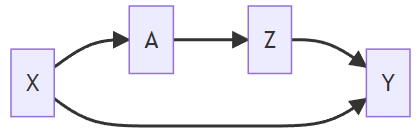

+ Frontdoor path: $A\rightarrow Z\rightarrow Y$ 
  
  Our interest is in the causal relationship between A and Y, where a part of this relationship is through the effect that A has on Z. It is not something we are concerned about at this point. We are interested in just how A affects Y regardless of what path it takes to get there.

+ Backdoor path: $A\leftarrow X \rightarrow Y$
  
  This backdoor path does not involve any arrows coming out of A. So there's no treatment effect involved there. But A and Y are still associated with each other through that path. So this is something we have to worry about. Because if we look at just marginal associations between A and Y, some of that association will be due to a causal effect of A and Y, while some of it also could be because X causes both A and Y. *Backdoor paths confound the relationship between A and Y and need to be blocked.*

### Backdoor Path Criterion

A set of variables X is sufficient to control for confounding if:

1. it blocks all backdoor paths from treatment to outcome

2. it does not include any descendants of treatment.

##### Example

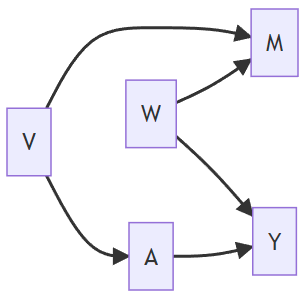

+ There is one backdoor path from A to Y, that is, $A\leftarrow V\rightarrow M\leftarrow W\rightarrow Y$
  
  + It is blocked by a collider M
  
  + No confounding (Information from V and W does not flow to Y and A because of M)

+ Set of variables that are sufficient to control for confounding:
  
  + Solutions: {},{V},{W},{M, W}, {M, V}, {M, V, W}
  
  + Never only control {M} since it will open a path between A and Y that is not causal

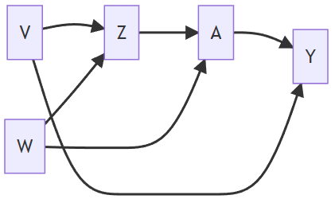

+ There are two paths
  
  + $A\leftarrow Z\leftarrow V\rightarrow Y$
    
    + No colliders
    
    + Solutions: {Z}, {V}, or {Z, V}
  
  + $A\leftarrow W\rightarrow Z\leftarrow V\rightarrow Y$
    
    + Z is a collider
    
    + Solutions: {V}, or {Z, V}, {Z, W}, and {Z, V, W}
      
      Once we control for Z, we need to block the backdoor path by including V, or W, or V and W

#### Summary

To use the backdoor path criterion, we are required to know the *whole DAG*.

### Disjunctive Cause Criterion

We do not need to know the whole graph, but rather, the list of variables that affect exposure or outcome.

##### Example

+ Observed pre-treatment variables: {M, W, V}

+ Unobserved pre-treatment variables: {U1, U2}

+ Suppose W and V are causes of A, Y, or both and M is not a cause of either A or Y

**Solution 1**: Use all pre-treatment covariates, i.e., {M, W, V}

**Solution 2**: Use variables <u>based on disjunctive cause criterion</u>, i.e., {W, V}

Let's check if these solutions fit in the DAG for $A\rightarrow Y$

**Hypothetical DAG 1**

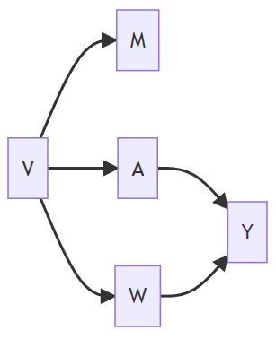

 

|                      | Satisfies Backdoor Path Criterion |
| -------------------- |:---------------------------------:|
| Solution 1 {M, W, V} | Yes                               |
| Solution 2 {W, V}    | Yes                               |

**Hypothetical DAG 2**

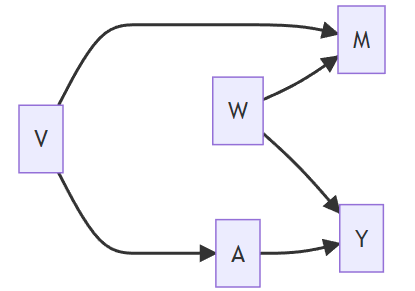

 

|                      | Satisfies Backdoor Path Criterion |
| -------------------- |:---------------------------------:|
| Solution 1 {M, W, V} | Yes                               |
| Solution 2 {W, V}    | Yes                               |

**Hypothetical DAG 3**

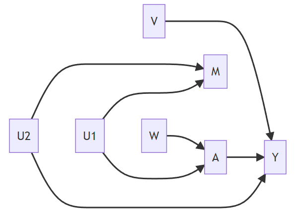

 

|                      | Satisfies Backdoor Path Criterion  |
| -------------------- |:----------------------------------:|
| Solution 1 {M, W, V} | No (b/c M opens the backdoor path) |
| Solution 2 {W, V}    | Yes                                |

**Hypothetical DAG 4**

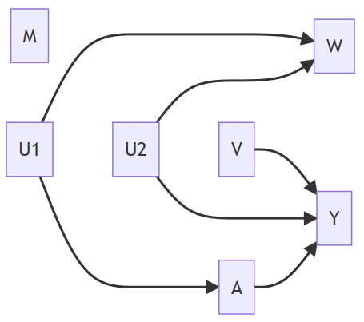

 

|                      | Satisfies Backdoor Path Criterion  |
| -------------------- |:----------------------------------:|
| Solution 1 {M, W, V} | No (b/c W opens the backdoor path) |
| Solution 2 {W, V}    | No (b/c W opens the backdoor path) |

#### Summary

The disjunctive cause criterion:

+ does not always select the smallest set of variables to control for (e.g., if we only have one collider in the whole DAG, the smallest set is $\empty$, that is, doing nothing)

+ but is conceptually simpler (i.e., list variables that are causes of treatment or outcome or both)

+ is guaranteed to select a set of variables that are sufficient to control for confounding if
  
  + such a set exists
  
  + all of the observed causes of A and Y are correctly identified (no need to know the whole DAG but do have to know about the relationship between observed variables)
