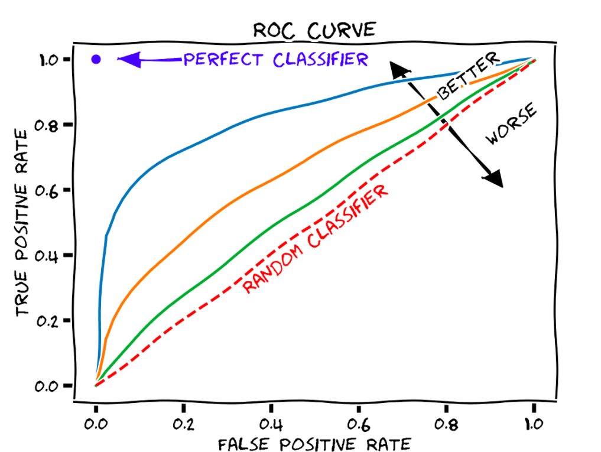
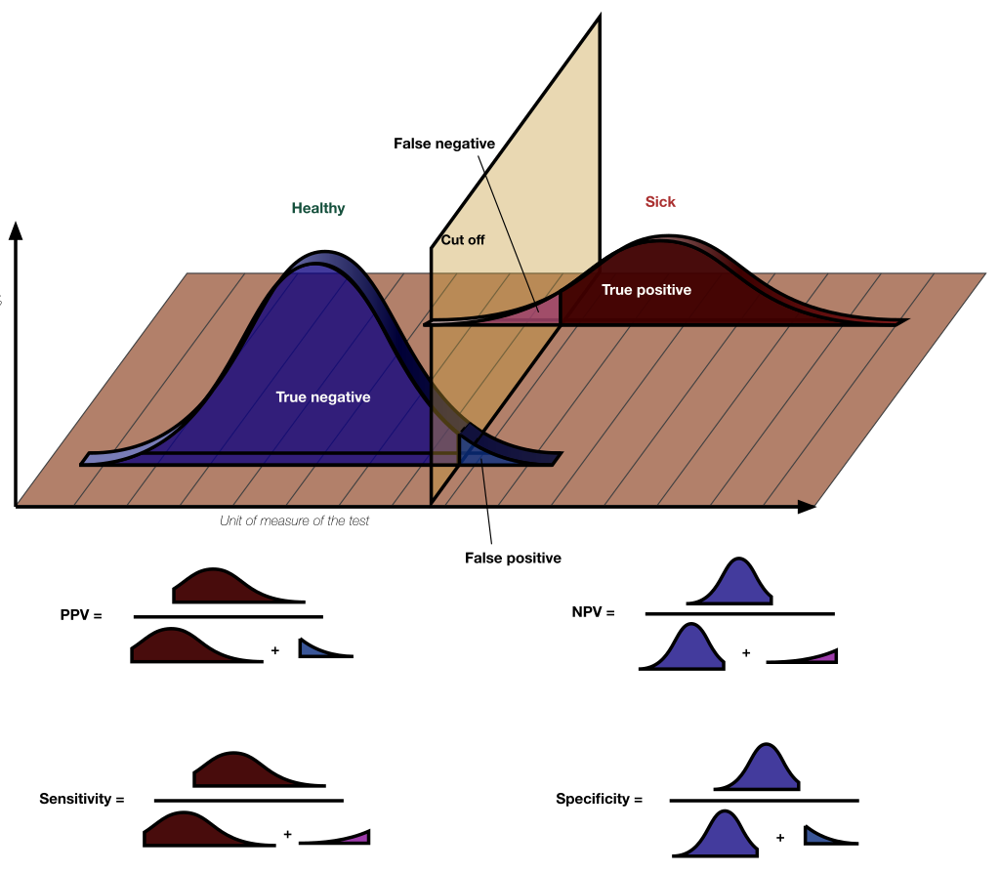

In the context of econometrics and the empirical analysis in microeconomics, we focus on the type I error and pay much attention on p-value evaluated at a given significance level ($\alpha$). I haven't cared about the type II error and the statistical power of a test ($1-\beta$) quite a while since I worked on some homework problems related to type II error in the graduate school as taking the Mathematical Statistics course.

When evaluating the results from a A/B testing and comparing the performances of alternative machine learning models, we inevitably encounter quite a few measures pertaining to type I and type II errors. In this post, I am going to review the error types and some relevant measures.

## Error Types

Errors arise in the process of the statistical testing. Let $H_0$ and $H_1$ denote the null and the alternative hypothesis for a test. By calculating a test statistic from an observed sample, we can reject $H_0$ or not. Because of the randomness, we sometimes might make a mistake as concluding with the value of a test statistic. Here is a table explicitly presenting the error types in a statistical test.

|                     | $H_0$ is true                        | $H_0$ is not true                     |
| ------------------- | :----------------------------------- | :------------------------------------ |
| Reject $H_0$        | Type I error  False Positive (FP) | Correct  True Positive (TP)        |
| Cannot reject $H_0$ | Correct True Negative (TN)        | Type II error  False Negative (FN) |

As follows, there are relevant measures build on this table:

+ Recall, Sensitivity, or True Positive Rate (TPR): 
  $$
  \frac{TP}{TP+FN}=1-\beta
  $$
  where $1-\beta$ represents the statistical power of the test.
+ False Positive Rate (FPR):
  $$
  \frac{FP}{FP+TN}=\alpha
  $$
  where $\alpha$ represents the significance level of the test.
  > In a binary classification problem, the TPR and the FPR will vary accordingly as we change the determination threshold in a model (e.g., the cut-off point for a logit model in predicting the credit default).
  >
  > 
  >
  > A **receiver (or relative) operating characteristic curve**, or **ROC curve**, is a [graphical plot](https://en.wikipedia.org/wiki/Graph_of_a_function) that illustrates the diagnostic ability of a [binary classifier](https://en.wikipedia.org/wiki/Binary_classifier) system <u>as its discrimination threshold is varied</u>. The method was originally developed for operators of military radar receivers, which is why it is so named.
  >
  > The optimal cut-off point on ROC can be determined by one of the three criteria ([Reference Link](http://www.medicalbiostatistics.com/roccurve.pdf)):
  >
  > + The farthest point from the random classifier, that is, max(TPR+FPR), the Youden index
  > + The closest point to the perfect classifier (0, 1)
  > + The point minimizing the cost.

+ Precision, or Positive Predictive Value (PPV):
  $$
  \frac{TP}{TP+FP}
  $$
+ Specificity, Selectivity, or True Negative Rate (TNR):
  $$
  \frac{TN}{TN+FP}=1-\alpha
  $$
+ Accuracy:
  $$
  \frac{TP+TN}{TP+TN+FP+FN}
  $$
+ F1 Score (Harmonic mean of precision and recall):
  $$
  \frac{1}{\frac{1}{2}\frac{1}{\text{Precision}}+\frac{1}{2}\frac{1}{\text{ Recall}}}=2\times\frac{\text{Precision}\times\text{Recall}}{\text{Precision}+\text{Recall}}
  $$
  > The harmonic mean is best used for fractions such as rates.
  >
  > For example, Joe drives a car at 10 mph for the half of the journey and 40 mph for the second half. What’s his average speed? The naïve answer is to calculate the total mileage of the journey and then divide it by the total drive time. Denote the total mileage of the journey as $x$ and the total drive time is $\frac{0.5x}{10}+\frac{0.5x}{40}$. Therefore, the average speed is $x/\left(\frac{0.5x}{10}+\frac{0.5x}{40}\right)=16$ mph.

## Trade-off between Errors

We cannot reduce the type I error (false positive) and the type II error (false negative) at the same time, once a testing environment is fixed and the observed results are given. Usually, we set the expected result as the alternative hypothesis $H_1$ and prefer minimizing $\alpha$ in a statistical test, the probability that we incorrectly reject $H_0$.

The figure below presents the change in $\alpha$ and $\beta$ as the cut-off point is altered in a given test. By construction, we would like to differentiate the distributions under $H_0$ and $H_1$ as much as possible.

In this figure, it is easy to see the specificity ($=1-\alpha$, also known as the confidence level) and the sensitivity ($=1-\beta$, also known as the statistical power of the test) representing the "true" portion of the $H_0$ distribution and the $H_1$ distribution, respectively.