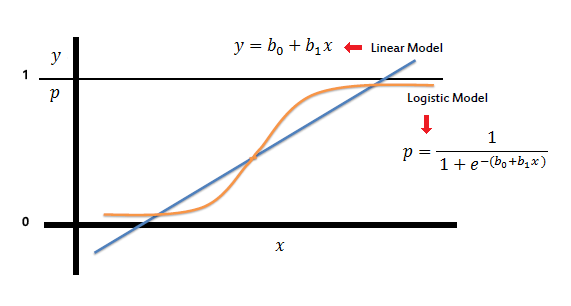

Logit regression has been used a lot in modeling selection problems. To review its relationship with the extreme value distribution, it is better to derive the analytical form of Logit regression from its error assumption of type I extreme value distribution. Actually, this is a homework exercise from my Ph.D. econometrics course. It is a great chance to refresh my mind by doing this exercise again.

## Generalized Extreme Value Distribution

Reference Link: [Generalized extreme value distribution - Wikipedia](https://en.wikipedia.org/wiki/Generalized_extreme_value_distribution)

Notions:

+ Location parameter $\mu\in\mathbb R$ and scale parameter $\sigma>0$

+ Standardized variable $s=(x-\mu)/\sigma$

+ Cumulative distribution function
  
  $$
  F(s)=\exp\left(-\exp\left(-s\right)\right)
  $$

+ Probability density function
  
  $$
  f(s)=\exp\left(-s\right)\exp\left(-\exp\left(-s\right)\right)
  $$

## Logit Function

### Indirect Utility

Suppose the indirect utility of choosing alternative $i$ is specified as

$$
u_i=x_i\beta+\varepsilon_i
$$

where $x_i$ is a vector of features of alternative $i$ and $\varepsilon_i$ follows the GEV.

### Derivation

Alternative $i$ is selected if $u_i\ge u_k$ for any $k\neq i$. Hence, the probability of choosing $i$ is

$$
\Pr(i)=\int_{\varepsilon_i}\prod_{k\neq i}\Pr(\varepsilon_k\le (x_i-x_k)\beta+\varepsilon_i)dF(\varepsilon_i).
$$

Note that

$$
\begin{align*}
\Pr(\varepsilon_k\le (x_i-x_k)\beta+\varepsilon_i)
&=\exp\left(-\exp\left(-(x_i-x_k)\beta-\varepsilon_i\right)\right) \\
&=\exp\left(-\exp\left(-(x_i-x_k)\beta\right)\times 
-\exp\left(-\varepsilon_i\right)\right) \\
&=\left[\exp\left(-\exp\left(-\varepsilon_i\right)\right)\right]^{a(x_k)} \\
\end{align*}
$$

where $a(x_k)=\exp\left(-(x_i-x_k)\beta\right)=$ is a constant.

The probability of choosing $i$ is then written as

$$
\begin{align*}
\Pr(i)&=\int_{\varepsilon_i}\prod_{k\neq i}\left[\exp\left(-\exp\left(-\varepsilon_i\right)\right)\right]^{a(x_k)}dF(\varepsilon_i)\\
&=\int_{\varepsilon_i}[F(\varepsilon_i)]^{\sum_{k\neq i} a(x_k)}dF(\varepsilon_i)\\
&=\left.\frac{1}{A+1}[F(\varepsilon_i)]^{A+1}\right|_{-\infty}^{+\infty}\\
&=\frac{1}{A+1}[F(+\infty)]^{A+1}-\frac{1}{A+1}[F(-\infty)]^{A+1}\\
&=\frac{1}{A+1}-0=\frac{1}{\sum_{k\neq i}\exp\left(-(x_i-x_k)\beta\right)+1}\\
&=\frac{1}{\sum_{k\neq i}[\exp\left(x_k\beta\right)/\exp\left(x_i\beta\right)]+1}\\
&=\frac{\exp\left(x_i\beta\right)}{\sum_{k\neq i}\exp\left(x_k\beta\right)+\exp\left(x_i\beta\right)}
\end{align*},
$$

where $A=\sum_ka(x_k)$, $F(+\infty)=\exp\left(-\exp\left(-\infty\right)\right)=1$, and $F(-\infty)=0$.

### Logit Regression

Reference Link: [Logistic regression - Wikipedia](https://en.wikipedia.org/wiki/Logistic_regression)

Let one of the alternatives be an opt-out and normalize the opt-out be zero. The logit form is given by

$$
\Pr(i)=\frac{\exp\left(x_i\beta\right)}{\sum_{j\in S}\exp\left(x_j\beta\right)+1}
$$

where $S=\{1,2,\dots,i,j,\dots,J\}$ is a set of mutually exclusive alternatives included in the analysis.
