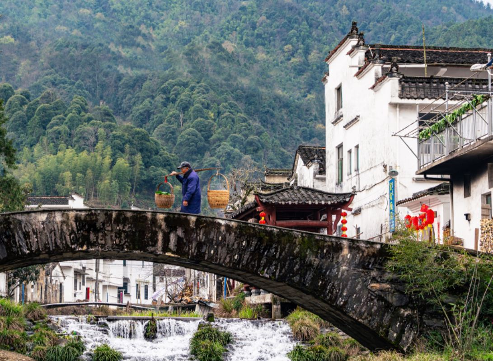

*This is a family memoir written by my father to my beloved grandpa.*

# 不一样的清明节

——纪念父亲离世一周年

今年的清明日，刚好是父亲离开我们一周年的日子，也是计划上我们兄妹五人为父亲第一次做清明的日子。可是计划不如变化快，近期全国各地新冠疫情似乎更加严重了，南昌、婺源都有零星病例，我们兄妹五人也因此不能返乡。没想到去年清明节在卧榻旁的守候，竟成了我们最后的相处时光。回想年少时和成年后的过往，记忆慢慢变得模糊起来。故趁这两天空闲，把记忆里最深刻的，时常回想的片段，用文字记录下来，当作这个清明节对父亲的思念吧。父亲，我们想念父亲。

## 记忆中的清明

往年清明节当天，都是父亲领着我们兄妹几个，上午去上坟，逐个祭拜爷爷奶奶，母亲，及更早的祖辈，挂些纸钱，烧些纸金银包、冥币。晚上在祖屋厅堂供上米饭鱼肉，点香祭拜列祖列宗，每次重复默念的祭词总少不了“父亲不要睡着了，要保佑父亲一身之下的人，保佑大家在外上车下车平平安安、工作顺顺利利，小孩读书年年升级、步步升高，好人相逢，恶人躲避……”。

从1982年到南昌读书，再到84年毕业分配至上饶工作起，因路途遥远、交通不便，记忆中就没有回官坑过清明了。但唇齿间总回味着清明果、蕨菜、小竹笋、猪头花[①]等家乡食物的味道，脑海里放映着石板路旁、小河边、房前屋后、稻田里、漫山遍野的各种油菜花、野花盛开的景象。到1998年，我考取了机动车驾驶证，从此就能自己开车往返工作地和官坑了。再后来，交通路况也逐步好起来了，也买了私家车。虽然因工作变动，我搬到了南昌，但感觉回官坑的路程也不那么遥远了。往后，官坑就成了清明节必须去的地方，这个习惯也就慢慢变成了责任。

## 模范农民

小学期间的事，因为年纪小，我大多已经记不得了。只是模糊记着，读小学的时候，我不爱读书，家里给每个人都分配了任务。我的主要任务是早晚放牛，牵牛喝水，投放牛料，打猪草。没有事的时候，我会经常跑到六队队屋里玩。那时父亲是生产队会计，每到生产队分玉米、分红薯的时候，我们小孩就特别高兴，而父亲就要算账，特别忙。每人或每户应分多少，按什么标准（权重）分，而且那时只能用算盘来加减乘除。因此，父亲也成了乡间算盘高手。有一次，县茶厂来招统计员，办事的专员发现父亲是乡间秀才，希望调父亲去县茶厂，可后来大队不同意，就此作罢。那时父亲也常常跟我们讲，经手财会类的事，一分钱都不能少、不能错。后来父亲也不止一次跟我们讲起一个事。有次生产队的社员质疑有一笔上级补助款大家没有分到，而且是好多年前的事。父亲就把账本、单据找出来跟大家仔细讲，多少用于计划生育妇女补助，多少替大家抵交农业税等等，讲得大家心服口服。平常父亲也跟我们几个兄妹讲“命里有时终须有，命里无时莫强求”，我们也时刻把父亲的话记在心里。

去年这个时候我们在父亲房间为他守灵时，看到父亲房间里两把用得破旧的算盘和一些记着生产队账务的落满灰尘的账本、发黄的单据依然挂在昏暗的木板墙上。

也许因为父亲读了点书，且特别尊尚传统文化、古人警言，常常在跟没有读过书的社员们讲道理时，挂着口头禅，经常说“过去老几（辈）人，如何如何,我们应该怎样怎样”。因此，村里人给父亲取了个绰号，叫“清朝”。

当年父亲不仅队长、会计做得称职，田地里的农活、挑驮力气活样样不落下。父亲常常跟我们讲，那时到秋口挑米，到屯溪挑茶是家常便饭。还说有一次清明前后挑担路过段莘溪边一户亲戚家，一口气吃了十八个清明果，可见长途挑担体力消耗之大。

还有一次，不记得我和兄弟谁，进七里源砍柴回家，路过上村对面父亲做砖瓦的草棚时，肚子饿得难受。父亲赶紧跑到棚边上，摘了一个自己种的嫩南瓜，炒起来让我们当饭吃，我们非常高兴，父亲也经常当笑话说起这事。

## 自力更生建房

记得1976年，我11岁，家里人多，祖上分下来的老屋住不下了。经过大队批准，父亲开始在太平灶北边的一个山坳里伐木，从段莘水库移民老屋基捡挑旧砖，在老屋后边大约80平米的菜园地里做了两直传统木屋。父亲常在我们面前自豪地说，当时猪肉价0.74元一斤，做这栋房屋请工匠等总共花费现金大约两千元，其余基本都是自己完成。我和华锋哥虽然也常常帮忙去山上驮一些小方料，放学后也到官坑口挑几块砖，但那时我们力气很小，只能帮一点点忙。想来父亲到老年，右肩驼得厉害，比左肩凸出好多，可能是中年时用力过度所致。何况当时驮木头，从山坳里上来要经过500米左右的羊肠上坡路。官坑也没通公路，从官坑口挑砖也要经过一段600米左右的上岭。一座房子的物料需要多少次日日夜夜的挑运啊！

终于在1978年，一家人住进了新屋，小弟华斌就是在新屋里出生的。也就是这段日子，父亲自力更生、勤劳节俭、精打细算的特质影响了我们兄妹几个一辈子。

## 送我读书

1979年，我在官坑附中读完两年制初中，毕业后前往河坑源段莘乡中学读高中。第一次要离开父母，离开官坑，住校读书。可能是年龄小不懂事，不习惯陌生环境，读书兴趣也不高。记得读了一个多月，便借故跑回家里不想读，拿起镰刀就要上山砍柴去，硬是被父亲打回学校的。印象中那是被打得最厉害的一次，我也感觉当时是我犟得最厉害的一次，还回嘴对骂，言语也很难听。如果要说一辈子我有什么对不住父母的话，那是唯一的一次，也是最后悔的一次。

两年高中，我很快就混到了毕业，1981年第一次参加高考。也许是段莘中学英语教学差，大家基本上都报考中专，结果只有一个女生去了上饶卫校。记得恢复高考前几年，段莘中学考上的人很少。官坑村只有两个人，一个是同一个生产队的汪新华，读了上饶师范，另一个是堂叔汪天祥，读了上饶卫校。后来不知是因为官坑有个慈祥的长辈洪应天老师在江湾中学当校长之故，还是华锋哥学了一年手艺又回到学校想读书的事影响了我，或是受父亲经常在我们面前讲“万般皆下品，唯有读书高”的影响，1981年下半年我又到江湾中学复读去了。

记得当时16岁的我，也许是农村人那时普遍营养不良，体重大约70斤左右，很是瘦小。第一天去江湾中学报到是父亲挑着被子和木箱子送我走路去的。快到江湾中学附近，路过一片雪梨地时，记得父亲买了两个让我们尝了尝。

从那天开始，我感觉才真正懂事了，才开始刻苦读书了。一方面，想想父母送两兄弟复读，在农村的确不易，也不多见。另一方面，或许是暑假期间跟着母亲田地里除草，热得受不了。或许是上山摘箬皮卖钱时，头怕山蜂，脚怕毒蛇的情景刺激着我。功夫没有白费，一年后终于以江湾中学第一名的成绩被录取到江西银行学校农村金融专业，更高兴的是华锋哥也同时考进了上饶农校。

## 家书抵万金

在通讯落后、交通不便的日子里，“家书抵万金”是现在很多年轻人无法体会的。就是一元钱的路费常常也舍不得花，乡愁就只能浓缩在一枚八分钱的邮票里了。从到了南昌读书后，直到上世纪九十年代末，与家里的联系就靠这枚小小的邮票了。

我和华锋哥进了中专学校读书后，乡村里许多一辈子跟泥土打交道的亲戚朋友都很羡慕。可是命运却开了个不小的玩笑，好像上帝故意要考验父亲一样，坏消息一个接一个：1982年下半年母亲生病，后来被诊断出是鼻咽癌；1983年大弟华树又生了一次大病，送外地就医；再后来父亲在田里干活时手又被蛇咬了……这些都靠书信来往得知。那时很希望一下课就能收到家里的来信，但信捏在自己手里的时候，又不敢拆开，怕看到坏消息。最后，最不幸的事还是发生了，1983年5月母亲还是离世了。

再后来，父亲家事、农活一个人更忙了，还有弟妹要读书要照顾抚养，有时一两个月都没有时间回我们的信。时间长了，心里就格外担心害怕。直到我和华锋哥毕业参加工作，一切才慢慢好起来。这时我们不仅常常写信向父亲报告一些好消息，也会通过邮局寄点钱回家补贴家用。

1988年，我写信回家，告诉父亲我找对象了，1989年春节带回官坑过年。父亲虽然言语不多，但内心的高兴还是看得出来的。当年4月28日，父亲和华锋哥来上饶参加我的结婚典礼，记得那天晚上，父亲们很晚到上饶。一方面是客车在路上耽误了，另一方面是两个人都没有来过上饶，下车后不认识路。那时小城市即买不到地图，路牌也很不规范，更没有电话手机。记得到我单位上饶农业银行都晚上十点钟了。第二天，新娘下婚车放鞭炮时，父亲也许是激动紧张，用一根火柴，划了好几次都未成功。这时我的一位退休留用的阿姨同事，一把抓过父亲手中的火柴，几根火柴一起划，着了，鞭炮响了。后来，我那位阿姨同事常常在我面前提起这个小插曲。

1990年2月小岛出生，我也是第一时间写信向父亲报喜。转眼到了1994年，华树毕业，分配到婺源邮电局[②]工作，一切都好起来了，交通也改善了，写信的次数就越来越少了。又过了几年，到了本世纪初，官坑外边溪关娣家安装了一部无线电话[③]，我们有急事、好事就通过关娣家电话联系了。好像又过了一年多，华树就帮我们自己家也装了一部无线电话，从那以后就再也没有写过信了，一家人相聚也容易多了。

## 幸福的晚年

2005到2006年间，我们四兄妹在双河汇合处合资建新房。那时父亲虽已年近七十，但头脑清晰，很会算账，又有建房经验，仍担任家里的总指挥。记忆中，这是父亲最后做的一件大事。2007年春节，我们兄妹五家大大小小都住到了新房里过年。从那时算起，父亲才开始真正享受自己的晚年生活，吃喝、洗衣有旺生和兴珠伺候。

日子好了，天天都好像过年过节一样，想吃什么都有。电话方便了，不仅座机有了，华树还帮父亲办了手机。有什么事或想谁了，一个电话就解决问题了。交通也方便多了，水泥路、高速路陆续通了。我们兄弟几个也都买了私家车，逢年过节大家总会不约而同地跑去官坑看望父亲。与此同时，我们也了却了心中的乡愁，品尝了小时候的味道。碰上不错的时机，我们也会带父亲出门走走，看看外面的世界，体验一下电视新闻里才看得到的地方。

记得带父亲到南昌过年的时候，父亲说城市里怎么到处是人山人海；记得开车带父亲去赣州玩，父亲还说车子没有坐够；记得路过吉安吃饭时，上了一份驴肉，回来后常常说好吃；带父亲去杭州玩时，父亲总回想小时候书上讲“上有天堂，下有苏杭”，一看西湖怎么这么大；带父亲去上海时，父亲感觉酒店里的自助早餐真实在，东方明珠塔怎么能建得那么高，同时也去看了我爷爷在上海生活期间置办的小屋，了结了多年的心愿。再从上海坐飞机回南昌时，父亲说怎么就只坐了一下下子。

我还记得带父亲去惠州华斌家过年的时候，父亲在街上看到人家过年打赤膊很是惊奇。我还记得父亲，常常讲华锋带着去婺源乡下吃米饭蒸狗肉，低头一口气吃了三小碗。也常讲华斌带父亲去北京时，北京的饺子如何如何实惠。还常讲县里华树家声琴做的饺子、包子是如何如何好吃。

也因为父亲走得多、看得多，在官坑，父亲跟亲朋好友谈天时，或是跟兴珠家游客吹牛时，话题自然丰富了很多。近年来，我问父亲想去哪，他说想去的都去过了，不想了，也许这就是知足吧。

晚年期间，每当我们有好友去官坑玩，或是兴珠家游客高兴起哄时，父亲偶尔也在小院里唱唱婺源小调。我们听得最多的是《劝善记》，虽然调子有些凄凉，但歌中劝大家和谐相处、与人为善的词句让人深受启发，我们兄妹几个也都受益匪浅。

因父亲略知中国民间风水历学，特别是熟悉婺源本地民间风俗礼仪，所以闲空之时官坑本地亲朋好友举办红白喜事、建屋盖房都喜欢请父亲挑日子、看风水、写对联、做司仪。亦或是分家，也愿意请父亲当公证人或代理书写契约。对于这些事，父亲从不开价收费。相反，他总是乐于相助，在忙碌中实现个人价值。

## 最后的时光

近几年来，父亲的听力减退了，我们也不常通电话。每逢节假日，我几乎都要开车去官坑看父亲。每次只要是讲了大概什么时间会到，父亲一定会站在停车场等候。同样，每次开车离开，父亲也一定会去停车场送别。虽然煽情的话不多，但彼此的内心一定是温暖的，现在这种感觉突然就没有了。

近几年，每次大年三十晚上团圆饭后，父亲都会提着小蓝子给我们大家发红包。无论男女老少，每人200元，很是热闹。小岛在美求学，因此也缺席了多年。但每次父亲见到我，总会提起，“小岛什么时候毕业，让他回来工作”。这份惦记，也许就是父亲心底里对孙辈的挂念吧。

近几年清明节，或是大年初二，父亲带我们去爷爷奶奶坟前祭拜结束后，他都会指着爷爷坟墓右边30米左右的一处空地，跟我们小声说上一句，“那个地方可以，离这也近，我以后可以放那”。去年清明，我问父亲寒食节是怎么来的，为什么婺源规矩不能挂纸钱，父亲跟我讲过后又拿出一本古书让我查对。最后还补上一句，“这本书人家出一万元想收购我都不肯”，又说，“以后这本书就传给你好了”。感觉是父亲自己知道时日不多，在妥善安排后事一样。没想到几天后，他就真要离开我们了。那时也没有机会说上一句话，也许这就是天意。

俗话说，“父母在，家就在。父母离去，人生只剩下归途”。现在终于体会到了其中的深意。在父亲离开的这一年里，我时常想起他过往的点点滴滴。各种场景涌上心头，感觉挥之不去。于是，我打算找个时间做个记录，传于后人。恰好这个清明假期，哪里也去不了，便打开电脑写下这些文字，当作对父亲的周年纪念吧。愿父亲在另一个世界里还是那么乐观、知足、快乐！

 

华亮

二零二二年农历三月初五 清明节

------

①: 猪头花是官坑一种可以蒸起来吃的野花。

②: 1994年，邮电局负责邮政、电信、移动三项业务。

③: 官坑的无线电话依靠段莘乡山顶一个无线差转台传送信号。
