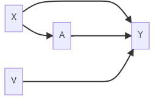
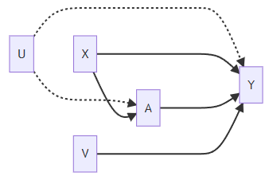
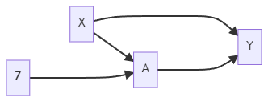

### Confounding

Classic confounding situation: X affects treatment A and affects outcome Y

+ **If X is observed**, we can analyze data using: *Matching*, *Propensity Score Matching*, and *IPTW*

+ Even if there are risk factors, V, it is valid to simply control for X

Suppose there are unmeasured/unobserved variables, U, that affect A and Y. Then we have **unmeasured confounding**.

+ Ignorability assumption violated: $Y^1,Y^0\not\perp A\mid X$

+ Given X, we cannot obtain a valid matching sample (pseudo-population)

### Instrument Variables

The instrument variables (IV) approach is an alternative causal inference method that does not rely on the ignorability assumption.

#### Encouragement Design

A: Smoking during Pregnancy (yes/no)

Y: Birth Weight

X: Parity, Mother's Age, Weight, etc.

Z: Randomize to either receive encouragement to stop smoking (Z=1) or receive usual care (Z=0)

> The encouragement will not affect the baby's birth weight through any path other than stopping smoking.

+ **Intention-to-treat** Analysis: Focus on the causal effect of encouragement
  
  $$
  {\rm E}\left(Y^{Z=1}\right) - {\rm E}\left(Y^{Z=0}\right)
  $$
  
  Note it is NOT a causal effect of smoking.

### Randomized Trials with Noncompliance

Randomize Trial

Z: randomization to treatment (1 if randomized to treatment,  0 otherwise)

A: treatment received (1 if receive treatment, 0 otherwise)

Y: outcome

+ Typically, NOT everyone assigned treatment will receive the treatment (e.g., Non-compliance)

+ Non-compliance makes a randomized trial like an observational study

+ Every subject will be assigned treatment Z and received treatment A.

+ Every subject has two potential values of treatment:
  
  + $A^{Z=0}=A^0$: It could be treatment (i.e., $A^0=1$) or no treatment (i.e.,$A^0=0$). It is the value of treatment if randomized to Z=0.
  
  + $A^{Z=1}=A^1$: It could be treatment or no treatment. It is the value of treatment if randomized to Z=1.

+ The **average causal effect** of <mark>treatment assignment on treatment received</mark>:
  
  $$
  {\rm E}(A^{Z=1}-A^{Z=0})
  $$
  
  + Estimable from the observed data:
    
    $$
    {\rm E}(A^{Z=z})={\rm E}(A\mid Z=z),\forall z\in \{0,1\}.
    $$

+ The **average causal effect** of treatment assignment on the outcome:
  
  $$
  {\rm E}(Y^{Z=1}-Y^{Z=0})
  $$
  
  + This is the average value of the outcome if everyone had been assigned to receive treatment minus the average outcome if no one had been assigned to receive the treatment. 
    
    + It is the intention-to-treat effect.
    
    + **If perfect compliance**, it would be equal to the causal effect of treatment.
  
  + Estimable from the observed data:
    
    $$
    {\rm E}(Y^{Z=z})={\rm E}(Y\mid Z=z),\forall z\in \{0,1\}.
    $$

### Compliance Classes

| $A^0$ | $A^1$ | Label         | Implication                                                                  |
| ----- | ----- | ------------- | ---------------------------------------------------------------------------- |
| 0     | 0     | Never-takers  | No variation in treatment received  and no information about causality    |
| 0     | 1     | Compliers     | Treatment received is randomized  by design. Hope we can learn something. |
| 1     | 0     | Defiers       | Assume this subpopulation is small  or does not exist.                    |
| 1     | 1     | Always-takers | No variation in treatment received  and no information about causality    |

#### Causal Effects

A motivation for using IV methods is concern about possible unmeasured confounding.

+ If there is unmeasured confounding, we cannot marginalize over alll confounders via matching, IPTW, etc.
  
  > Both matching and IPTW create a balanced sample or pseudo-population to measure the causal effect averaged over the whole population.

IV methods do not focus on the average causal effect for the population. They focus on a **local average treatment effect** (LATE) evaluated from a subpopulation of compliers.

+ It is also known as the complier average causal effect (CACE).

#### Observed Data

| $Z$ | $A$ | $A^{Z=0}$ | $A^{Z=1}$ | Class                      |
| --- | --- | --------- | --------- | -------------------------- |
| 0   | 0   | 0         | ?         | Never-takers or Compliers  |
| 0   | 1   | 1         | ?         | Always-takers or Defiers   |
| 1   | 0   | ?         | 0         | Never-takers or Defiers    |
| 1   | 1   | ?         | 1         | Always-takers or Compliers |

+ Compliance classes are also known as **principal strata**, which are latent.

+ Without additional assumptions, we cannot identify each subject into one of four categories. We can only narrow it down to two categories, however.

### Monotonicity Assumption

A variable is an instrumental variable (IV) if

1. It is associated with the treatment;

2. It affects the outcome only through its effect on treatment (also known as the exclusion restriction).
   
   + Randomization should not be affecting the outcome, except possibly through the impact that randomization had on what treatment somebody received.
   
   + A valid IV should not affect unmeasured confounders.

The **monotonicity assumption** is that there are no defiers.

+ The probability of treatment should increase with more encouragement.

+ No one consistently does the opposite of what they are told.

With this monotonicity assumption, now we have enough information to identify the causal effect among compliers. For observed data, we have

| $Z$ | $A$ | $A^{Z=0}$ | $A^{Z=1}$ | Class                        |
| --- | --- | --------- | --------- | ---------------------------- |
| 0   | 0   | 0         | ?         | Never-takers or Compliers    |
| 0   | 1   | 1         | ~~?~~=>1  | Always-takers ~~or Defiers~~ |
| 1   | 0   | ~~?~~=>0  | 0         | Never-takers ~~or Defiers~~  |
| 1   | 1   | ?         | 1         | Always-takers or Compliers   |

### Causal Effect Identification and Estimation

Intention-to-treat effect:

$$
{\rm E}(Y^{Z=1}-Y^{Z=0}) = {\rm E}(Y\mid Z=1)-{\rm E}(Y \mid Z=0)
$$

where

$$
\begin{align*}
{\rm E}(Y\mid Z=1)&={\rm E}(Y\mid Z=1,\text{always takers})\Pr(\text{always takers})\\\
                  &+{\rm E}(Y\mid Z=1,\text{never takers})\Pr(\text{never takers})\\\
                  &+{\rm E}(Y\mid Z=1,\text{compliers})\Pr(\text{compliers}).
\end{align*}
$$

Note: Among always takers and never takers, we can drop the condition on Z:

+ ${\rm E}(Y\mid Z=1,\text{always takers})={\rm E}(Y\mid \text{always takers})$

+ ${\rm E}(Y\mid Z=1,\text{never takers})={\rm E}(Y\mid \text{never takers})$

Then we can simplify ${\rm E}(Y\mid Z=1)$ and ${\rm E}(Y\mid Z=0)$:

$$
\begin{align*}
{\rm E}(Y\mid Z=1)&={\rm E}(Y\mid \text{always takers})\Pr(\text{always takers})\\\
                  &+{\rm E}(Y\mid \text{never takers})\Pr(\text{never takers})\\\
                  &+{\rm E}(Y\mid Z=1,\text{compliers})\Pr(\text{compliers})
\end{align*}
$$

and

$$
\begin{align*}
{\rm E}(Y\mid Z=0)&={\rm E}(Y\mid \text{always takers})\Pr(\text{always takers})\\\
                  &+{\rm E}(Y\mid \text{never takers})\Pr(\text{never takers})\\\
                  &+{\rm E}(Y\mid Z=0,\text{compliers})\Pr(\text{compliers}).
\end{align*}
$$

Therefore,

$$
\begin{align*}
{\rm E}(Y^{Z=1}-Y^{Z=0})&={\rm E}(Y\mid Z=1)-{\rm E}(Y \mid Z=0)\\\
                        &={\rm E}(Y\mid Z=1,\text{compliers})\Pr(\text{compliers})\\\
                        &-{\rm E}(Y\mid Z=0,\text{compliers})\Pr(\text{compliers}),
\end{align*}
$$

which implies

$$
\begin{align*}
\frac{\text{E}(Y\mid Z=1)-\text{E}(Y \mid Z=0)}{\Pr(\text{compliers})}
&={\rm E}(Y\mid Z=1,\text{compliers})-{\rm E}(Y\mid Z=0,\text{compliers})\\\
&={\rm E}(Y^{A=1}\mid \text{compliers})-{\rm E}(Y^{A=0}\mid \text{compliers})\\\
&={\rm CACE}.
\end{align*}
$$

> For the second line of the equation, because Z was randomized and these subjects are compliers, randomizing Z can be referred to as randomizing A.

Also, $\Pr(\text{compliers})={\rm E}(A\mid Z=1)-{\rm E}(A\mid Z=0)$.

+ ${\rm E}(A\mid Z=1)$: Proportion of people who are always takers or compliers

+ ${\rm E}(A\mid Z=0)$: Proportion of people who are always takers

+ The difference is the proportion of compliers

As a result, we have

$$
\text{CACE}=\frac{\text{E}(Y\mid Z=1)-\text{E}(Y\mid Z=0)}{\text{E}(A\mid Z=1)-\text{E}(A\mid Z=0)}\left(=\frac{\text{Intention-to-treat}}{\Pr(\text{compliers})}\right)
$$

where the numerator is the IIT and the denominator is the causal effect of treatment assignment on the treatment received.

+ If perfect compliance, CACE=ITT.

+ Denominator always between 0 and 1. Thus, CACE will be at least as large as ITT. 
  
  + **ITT is an underestimate of CACE** because some people assigned to treatment did not take it.

#### Summary

+ IV requires 2 key assumptions, the strongest of which is the exclusion restriction.

+ If one also makes the monotonicity assumption, then the complier average causal effect is identified.

### Sensitivity Analysis

Sensitivity analysis is developed for each of the IV assumptions:

+ Exclusion Analysis: If Z does directly affect Y by an amount $\rho$, would my conclusions change?

+ Monotonicity: If the proportion of defiers was $\pi$, would my conclusions change?

<mark>Reference</mark>: Baiocchi et al. (2014) "Tutorial in Biostatistics: Instrumental Variable Methods for Causal Inference."

### Weak Instruments

The strength of an IV is how well it predicts treatment received.

+ A strong instrument is highly predictive of treatment.
  
  + Encouragement greatly increases the probability of treatment

+ A weak instrument is weakly predictive of treatment.
  
  + Encouragement barely increases the probability of treatment

#### Strength of IVs

Estimate the proportion of compliers: ${\rm E}(A\mid Z=1)-{\rm E}(A\mid Z=0)$

+ If this number is close to 1, it has a strong instrument;

+ If close to 0, it has a weak instrument.

> This proportion implies an effective sample size.

Suppose only 1% of the population are compliers. *This leads to very large variance estimates, resulting in unstable estimates of causal effects*. It would likely produce confidence intervals that are too wide to be useful.

**Strengthen Instrument**: Near/far Matching

+ Match so that covariates are similar but the instrument is very different

+ Reference: Baiocchi et al. (2012) "Near/far matching:  a study design approach to instrumental variables."
