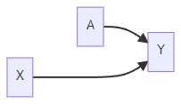

### Observational Studies

#### Randomized Trials

+ Treatment assignment A would be determined by a fair coin flip
    

+ No backdoor path from A to Y

+ Distributions of pre-treatment variables X that affect Y are the same in both treatment groups (covariate balance)

Thus, if the outcome distribution ends up differing, it will not be attributable to differences in X.

#### Why not always randomize?

+ Randomized trials are expensive.

+ Randomizing treatment/exposure is unethical.

+ Some (many) people will refuse to participate in trials.

+ Randomized trials take time (you have to wait for outcome data). In some cases, by the time you have outcome data, the question might no longer be relevant.

#### Observational Studies

+ Data Collection Types:
  
  + Planned, prospective, active data collection
  
  + Databases, retrospective, passive data collection

+ In observational studies, the distribution of X will differ between treatment groups

### Overview of Matching
#### Matching
Matching is a method that attempts to make an observational study more like a randomized trial.

+ Controlling for confounders is achieved at the design phase without looking at the outcome. In other words, matching is similar to randomized control trials (RCT) that we are blind to the outcomes. 

+ Matching reveals the lack of overlap in covariate distribution.

+ Once matched, data are treated as if from a randomized trial.

#### Stochastic Balance
In a randomized trial, treated and control subjects are not perfectly matched. The distribution of covariates, however, is balanced between groups, which we call *stochastic balance*.

+ Matching on covariates can achieve stochastic balance.

+ We start with the treated group and make the distribution of covariates in the control population look like that in the treated population.
  
  + The estimate from this procedure is a *causal effect of treatment on the treated*.

+ In matching, we *typically* focus on the causal effect of treatment on the treated, because we find matches for each treated person from the control population. So what we are making inferences about is the treated population.
  
  + We can do matching where we make the treated and the control populations not only look like each other but also look like the population as a whole. It involves more complicated techniques but is feasible.

#### Fine Balance

Sometimes we might be willing to accept some non-ideal matches if treated and control groups have the same distribution of covariates.

> [Example] 
> 
> Match 1: treated, male, age 40 and control, female, age 45
> 
> Match 2: treated, female, age 45 and control, male, age 40
> 
> It is not an ideal match because the treated male and female are matched with the control female and male of different ages. We don't achieve the stochastic balance. However, the overall average age and percentage of males are the same in both groups, even though neither match is great. This is considered a **fine match**.

It's always going to look for the best pairwise kind of matches, but we will tolerate some bad matches as long as we get a fine balance.

#### Number of Matches

+ One-to-one (pair matching)

+ Many-to-one (k controls to every treated subject)

+ Mixed
  
  + Sometimes match 1, sometimes more than 1, control to treated subjects
  
  + If multiple good matches are available, use them.

### Matching on Confounders

In the matching, "distance" is a measure of how similar the values of confounders are for different people.

+ Mahalanobis Distance
  
  $$
  D(X_i,X_j)=\sqrt{(X_i-X_j)^TS^{-1}(X_i-X_j)}
  $$
  
  where $X_i=[x_{i1},\dots,x_{iK}]$ and $X_j=[x_{j1},\dots,x_{jK}]$ are K-by-1 vectors of K covariates for row $i$ and $j$ (i.e., individual $i$ and $j$) in data $X$, and $S=COV(X)$ is a K-by-K covariance matrix.
  
  + $S_{kk'}={\rm E}[(x^k-\bar x^k)(x^{k'}-\bar x^{k'})]$ where $\bar x^k$ and $\bar x^{k'}$ are the sample means of covariate $k$ and $k'$ over $n$ observations.
  
  + In other words, M distance is the square root of the sum of squared distances between each covariate scaled by the covariance matrix.
  
  + [Program Mahalanobis Distance in Python](https://www.machinelearningplus.com/statistics/mahalanobis-distance/)

+ Robust Mahalanobis Distance
  
  + Motivation
    
    + Outliers can create large distances between subjects, even if the covariates are otherwise similar
    
    + The ranks might be more relevant
      
      > [Example] Highest and second-highest ranked values of covariates perhaps should be treated as similar, even if the values are far apart.
  
  + Calculation
    
    + Replace each covariate value with its rank
    
    + Constant diagonal on the covariance matrix
    
    + Calculate the usual Mahalanobis distance on the ranks