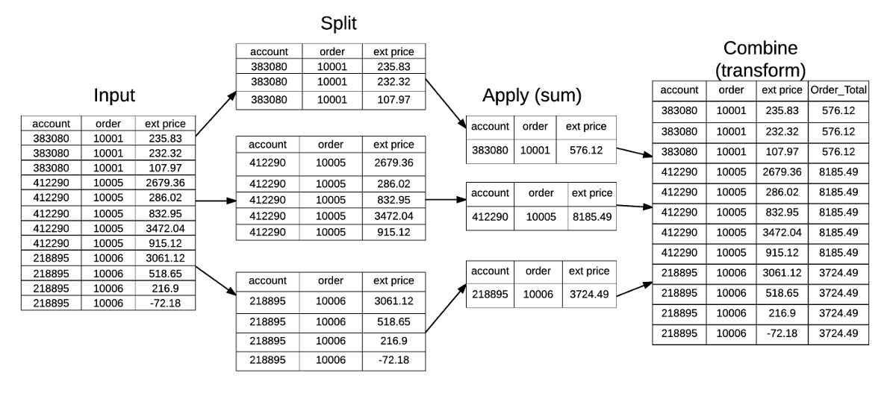
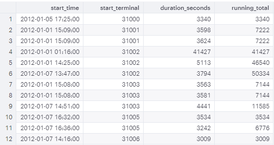
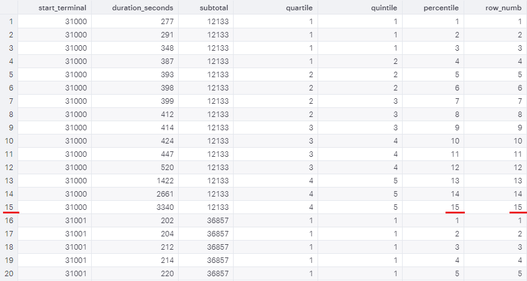
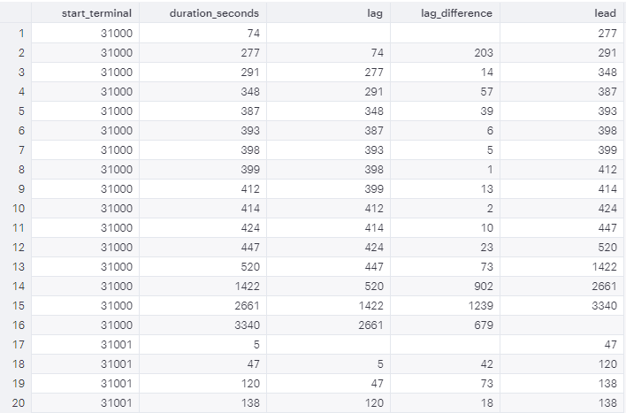

Aggregating over groups and calculating summary statistics by group provide an informative angle to review the data. As examining the data at the disaggregated level, we might prefer including the summary statistics aside. Therefore, we need to merge a table of summary statistics at the group level back to the disaggregated data using group ID. *Window functions* are introduced in SQL to facilitate this process.

> A *window function* performs a calculation across a set of table rows that are somehow related to the current row. This is comparable to the type of calculation that can be done with an aggregate function. **In contrast to regular aggregate functions, use of a window function does not cause rows to become grouped into a single output row** -- the rows retain their separate identities ([MODE Tutorial Link](https://mode.com/sql-tutorial/sql-window-functions/#intro-to-window-functions)).

This post summarizes the primary use of window functions by presenting practice examples.


## The `OVER` Clause Syntax

The basic syntax of window function is to use SQL functions (either aggregate functions such as `SUM`, `COUNT`, and `AVG` or row-wise functions such as `ROW_NUMBER()` and `RANK()`) together with the `OVER` clause.

```sql
---- OVER (ORDER BY) ----
SELECT
  start_time,
  duration_seconds,
  SUM(duration_seconds) OVER (
    ORDER BY
      start_time
  ) AS cumsum -- cumulative sum overall
FROM
  tutorial.dc_bikeshare_q1_2012

---- OVER (PARTITION BY) ----
SELECT
  start_terminal,
  duration_seconds,
  SUM(duration_seconds) OVER (
    PARTITION BY start_terminal
  ) AS sub_total -- subtotal by group
FROM
  tutorial.dc_bikeshare_q1_2012

---- OVER (PARTITION BY + ORDER BY) ----

SELECT
  start_terminal,
  duration_seconds,
  SUM(duration_seconds) OVER (
    PARTITION BY start_terminal
    ORDER BY
      start_time
  ) AS running_total -- cumsum within group
FROM
  tutorial.dc_bikeshare_q1_2012
```

> The `PARTITION BY` clause within the `OVER` clause divides the data into subsets by the values of selected columns.


## `GROUP BY` + `JOIN` = Window Functions

Here is a diagram to illustrate this `GROUP BY`+`JOIN` process:



> This can be completed by `pandas.DataFrame.transform` in Python ([Reference Link](https://pbpython.com/pandas_transform.html)) or `DT[, .SD, by]` using `data.table` package in R ([Reference Link](https://rdatatable.gitlab.io/data.table/articles/datatable-sd-usage.html)).

```sql
---- Window Functions ----
SELECT
  start_terminal,
  duration_seconds,
  COUNT(duration_seconds) OVER (PARTITION BY start_terminal) AS n_duration,
  SUM(duration_seconds) OVER (PARTITION BY start_terminal) AS subtotal_duration
FROM
  tutorial.dc_bikeshare_q1_2012
WHERE
  start_time < '2012-01-08'
  AND duration_seconds > 3000
ORDER BY
  start_terminal,
  duration_seconds

---- GROUP BY + LEFT JOIN ----
SELECT
  raw.start_terminal,
  duration_seconds,
  n_duration,
  subtotal_duration
FROM
  tutorial.dc_bikeshare_q1_2012 raw
  LEFT JOIN (
    SELECT
      start_terminal,
      COUNT(duration_seconds) AS n_duration,
      SUM(duration_seconds) AS subtotal_duration
    FROM
      tutorial.dc_bikeshare_q1_2012
    WHERE
      start_time < '2012-01-08'
      AND duration_seconds > 3000
    GROUP BY
      start_terminal
  ) subsum ON subsum.start_terminal = raw.start_terminal
WHERE
  raw.start_time < '2012-01-08'
  AND raw.duration_seconds > 3000
ORDER BY
  start_terminal,
  duration_seconds
```




## `ROW_NUMBER()`, `RANK()`, and `DENSE_RANK()`

When labeling the row numbers, we are thinking of `ROW_NUMBER()`, `RANK()`, and `DENSE_RANK()`. 

+ `RANK()` vs. `ROW_NUMBER()`

  For example, if you order by `start_time`, there might exist some rows with identical start times. `RANK()` gives the same rank to these rows, whereas `ROW_NUMBER()` gives them different numbers in order. 

+ `RANK()` vs. `DENSE_RANK()`

  For example, `RANK()` would give the identical rows a rank of 2, then might give 5 by skipping the ranks 3 and 4. In contrast, `DENSE_RANK()` would not skip any rank. It gives all the identical rows a rank of 2, followed by 3.

```sql
---- ROW_NUMBER() ----
SELECT start_terminal,
       start_time,
       duration_seconds,
       ROW_NUMBER() OVER (
         PARTITION BY start_terminal
         ORDER BY start_time
       ) AS row_number
  FROM tutorial.dc_bikeshare_q1_2012
 WHERE start_time < '2012-01-08'

---- RANK() ----
SELECT start_terminal,
       duration_seconds,
       RANK() OVER (
         PARTITION BY start_terminal
         ORDER BY start_time
       ) AS rank
  FROM tutorial.dc_bikeshare_q1_2012
 WHERE start_time < '2012-01-08'
```


## Quartile, Quintile, and Percentile

Use the window function `NTILE(# of buckets)` to label the subgroups ordered by selected columns.

```sql
SELECT start_terminal,
       duration_seconds,
       NTILE(4) OVER
         (PARTITION BY start_terminal ORDER BY duration_seconds)
          AS quartile,
       NTILE(5) OVER
         (PARTITION BY start_terminal ORDER BY duration_seconds)
         AS quintile,
       NTILE(100) OVER
         (PARTITION BY start_terminal ORDER BY duration_seconds)
         AS percentile
  FROM tutorial.dc_bikeshare_q1_2012
 WHERE start_time < '2012-01-08'
   AND duration_seconds > 300
 ORDER BY start_terminal, duration_seconds
```

### Window Alias

If you're planning to write several window functions in to the same query, using the same window, you can create an alias. The `WINDOW` clause, if included, should always come *after* the `WHERE` clause.

```sql
SELECT start_terminal,
       duration_seconds,
       SUM(duration_seconds) OVER (PARTITION BY start_terminal) AS subtotal,
       NTILE(4) OVER ntile_window                               AS quartile,
       NTILE(5) OVER ntile_window                               AS quintile,
       NTILE(100) OVER ntile_window                             AS percentile,
       ROW_NUMBER() OVER ntile_window                           AS row_numb
  FROM tutorial.dc_bikeshare_q1_2012
 WHERE start_time < '2012-01-08'
  AND duration_seconds > 300
WINDOW ntile_window AS
         (PARTITION BY start_terminal ORDER BY duration_seconds)
 ORDER BY start_terminal, duration_seconds
```



>When `# of buckets` is greater than the number of records, `NTILE()` == `ROW_NUMBER()`.


## Comparing to The Preceding or Following Rows

You can use `LAG` or `LEAD` to create columns that pull values from other rows.

```sql
SELECT start_terminal,
       duration_seconds,
       LAG(duration_seconds, 1) OVER
         (PARTITION BY start_terminal ORDER BY duration_seconds) AS lag,
       duration_seconds -LAG(duration_seconds, 1) OVER
         (PARTITION BY start_terminal ORDER BY duration_seconds)
         AS lag_difference,
       LEAD(duration_seconds, 1) OVER
         (PARTITION BY start_terminal ORDER BY duration_seconds) AS lead
  FROM tutorial.dc_bikeshare_q1_2012
 WHERE start_time < '2012-01-08'
 ORDER BY start_terminal, duration_seconds
```

