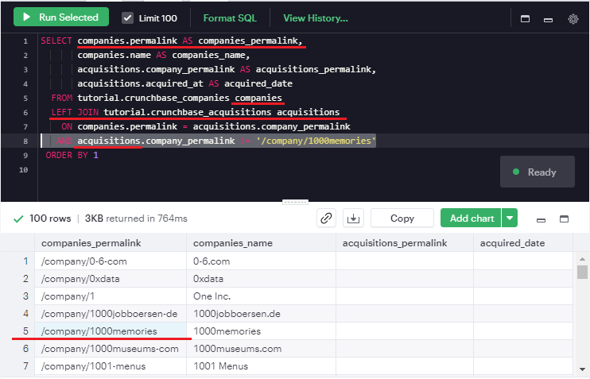
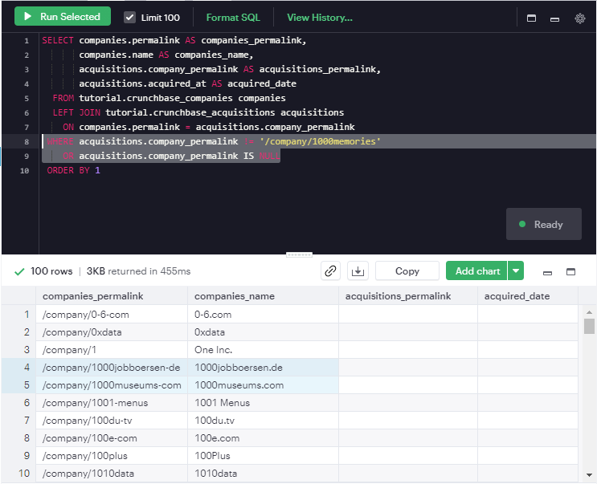
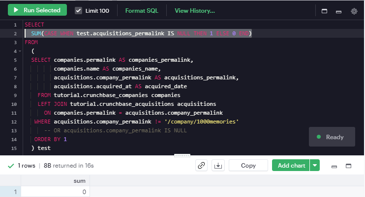

When merging tables with selected rows in SQL, we often think of using the `JOIN` statement with the `WHERE` and the `ON` clause. The resulting table would depend on the inclusion of filters in the `WHERE` or the `ON` clause. To illustrate this difference, I employ the SQL examples from [a MODE tutorial page](https://mode.com/sql-tutorial/sql-joins-where-vs-on/).


## Filtering in The `ON` Clause

```sql
SELECT companies.permalink            AS companies_permalink,
       companies.name                 AS companies_name,
       acquisitions.company_permalink AS acquisitions_permalink,
       acquisitions.acquired_at       AS acquired_date
  FROM tutorial.crunchbase_companies         companies
  LEFT JOIN tutorial.crunchbase_acquisitions acquisitions
    ON companies.permalink = acquisitions.company_permalink
   AND acquisitions.company_permalink != '/company/1000memories'
 ORDER BY 1
```

> `ORDER BY 1` is equivalent to `ORDER BY companies.permalink` 

The conditional statement `AND...` is evaluated **before** the join occurs. Particularly, the `AND` statement is evaluated on the joining  table (i.e., `acquisitions`) rather than the target table (i.e., `companies`). Hence, the 1000memories permalink is still displayed in the column that pulls from the target table (i.e., `companies`).




## Filtering in The `WHERE` Clause

```sql
SELECT companies.permalink            AS companies_permalink,
       companies.name                 AS companies_name,
       acquisitions.company_permalink AS acquisitions_permalink,
       acquisitions.acquired_at       AS acquired_date
  FROM tutorial.crunchbase_companies         companies
  LEFT JOIN tutorial.crunchbase_acquisitions acquisitions
    ON companies.permalink = acquisitions.company_permalink
 WHERE acquisitions.company_permalink != '/company/1000memories'
    OR acquisitions.company_permalink IS NULL
 ORDER BY 1
```

If you move the same filter to the `WHERE` clause, you will notice that the filter happens **after** the tables are joined. The result is that the 1000 memories row is joined onto the original table, but then it is filtered out entirely (in both tables) in the `WHERE` clause before displaying results (it would have been between the two highlighted lines in the resulting table below).



Note *that filtering in the* `WHERE` *clause can also filter null values*, so we added an extra line to make sure to include the nulls.

> The null values will not be evaluated using comparison operators.
>
> 

