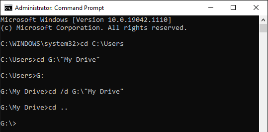

<p class='twelve columns' style="text-align: center;">
    
</p>

This July, Google released a new Google Drive desktop app to replace old versions. The biggest change is that I cannot find a local path for files that are selected to be synced to the corresponding files in Google Drive.

## Problem

It bothered me since I mapped a virtual drive `W:` to the local Google Drive folder using a `.bat` file with a Windows command [`subst`](https://docs.microsoft.com/en-us/windows-server/administration/windows-commands/subst) executed when I log into Windows. I learned this trick from my professor at UTK. It allowed me to keep a consistent working directory in my coding scripts. At the beginning of a script, I usually define a working directory at `W:` which is synced to my Google Drive. Using this trick, I no longer need to change the existing directory when switching my working computer from the desktop in my office to the laptop at home.

Now, the new Google Drive desktop app does not maintain a local path. Instead, it creates a drive, named "Google Drive," after it starts as I am logging into Windows. The computer executes the selected software in the Windows Startup list. However, the new Google Drive app takes a little longer to fully start than my `.bat`. Therefore, when the `.bat` starts, it cannot find the corresponding path to be mapped to `W:`.

## Solution

I turn off "Google Drive" in the Windows Startup list, while use the `.bat` file to start it before executing the `subst` command.

Here is an example of my `.bat` file, say `vdrive.bat`.

```powershell
@echo off
subst M: "C:\Users\<username>\OneDrive - azureford"
start C:\"Program Files"\Google\"Drive File Stream"\51.0.16.0\GoogleDriveFS.exe
timeout /t 8 /nobreak > nul
subst W: "G:\My Drive"
```

> Notes: Please replace `<username>` with your username. If interested, feel free to check the references for windows commands, [`echo`](https://docs.microsoft.com/en-us/windows-server/administration/windows-commands/echo), [`start`](https://docs.microsoft.com/en-us/windows-server/administration/windows-commands/start), and [`timeout`](https://docs.microsoft.com/en-us/windows-server/administration/windows-commands/timeout).

`vdrive.bat` will be started as I log into Windows if it is added to Windows Registry as a string value in `[HKEY_LOCAL_MACHINE\SOFTWARE\Microsoft\Windows\CurrentVersion\Run]`. I need define a value name and the value data for this string value, where the value name is a string displayed in the Windows Startup list and the value data is a path with double quotation marks at both ends, e.g., `"C:\vdrive.bat"`.

Every time, when `vdrive.bat` starts, a Command Prompt window appears. I don't want to see that as I log into Windows. So I create a shortcut for `vdrive.bat`, that is, `vdrive.bat.lnk`. Right click the shortcut file, choose "Minimized" in Run, and save the change. Then I update the value data to `"C:\vdrive.bat.lnk"` in Windows Registry. Awesome, it works perfectly!

Don't want to work in Windows Registry for the Startup list. No problem. You can put the shortcut in the following directory:

> Startup folder for user:
> `C:\Users\<username>\AppData\Roaming\Microsoft\Windows\Start Menu\Programs\Startup`
>
> Startup folder for all users:
> `C:\ProgramData\Microsoft\Windows\Start Menu\Programs\Startup`

### Navigating in Command Prompt

In Command Prompt, the default [`cd`](https://docs.microsoft.com/en-us/windows-server/administration/windows-commands/cd) command allows us to change the working directory within the same drive. When changing to a directory in another drive,

1. we need switch to the target drive first by typing the letter of the drive and then direct us to the target directory using `cd`, or
2. we can add a parameter in the `cd` command, i.e., `cd /d "<path in another drive>"`.

<p class='twelve columns' style="text-align: center;">
    
</p>


